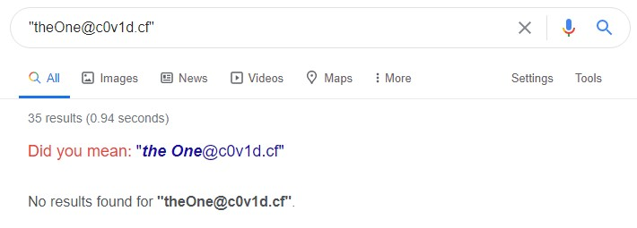
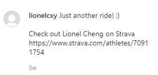
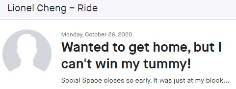
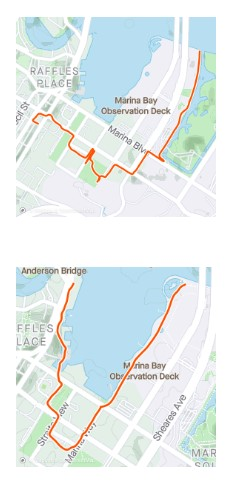

This is an OSINT challenge from the inaugural STACK The Flags in 2020. (Team bella ciao) 

## Challenge Description

***

After solving the past two incidents, COViD sent a death threat via email today. Can you help us investigate the origins of the email and identify the suspect that is working for COViD? We will need as much information as possible so that we can perform our arrest!

Required flag format: `govtech-csg{fullname-phone number[9digits]-residential postal code[6digits]}`

***

### Death Threat Email

A EML file was provided. Its contents are shown below.

```
X-Pm-Origin: internal
X-Pm-Content-Encryption: end-to-end
Subject: YOU ARE WARNED!
From: theOne <theOne@c0v1d.cf>
Date: Fri, 4 Dec 2020 21:27:07 +0800
Mime-Version: 1.0
Content-Type: multipart/mixed;boundary=---------------------9d9b7a65470a533c33537323d475531b
To: cyberdefenders@panjang.cdg <cyberdefenders@panjang.cdg>

-----------------------9d9b7a65470a533c33537323d475531b
Content-Type: multipart/related;boundary=---------------------618fd3b1e5dbb594048e34eeb9e9fcdb

-----------------------618fd3b1e5dbb594048e34eeb9e9fcdb
Content-Type: text/html;charset=utf-8
Content-Transfer-Encoding: base64

PGRpdj5USEVSRSBXSUxMIEJFIE5PIFNFQ09ORCBDSEFOQ0UuIEJFIFBSRVBBUkVELjwvZGl2Pg==
-----------------------618fd3b1e5dbb594048e34eeb9e9fcdb--
-----------------------9d9b7a65470a533c33537323d475531b--
```

We can decode the message with base64.

```
$ echo "PGRpdj5USEVSRSBXSUxMIEJFIE5PIFNFQ09ORCBDSEFOQ0UuIEJFIFBSRVBBUkVELjwvZGl2Pg==" | base64 -d
<div>THERE WILL BE NO SECOND CHANCE. BE PREPARED.</div>
```

For a more user-friendly view of the email, you can open the EML file with online viewers like [this one](https://www.encryptomatic.com/viewer/). However, while these online tools are convenient, if confidentiality of the EML file is a concern, opening it locally with a mail client like Outlook is a better idea.

## Initial Recon

The email message does not seem to contain any identifying clues. So as suggested in the description, we start by investigating the origins of the email.

To proceed systematically, first we recognize that each email address gives us three pieces of information to investigate:

1. The handle - `theOne`
2. The email address - `theOne@c0v1d.cf`
3. The domain name - `c0v1d.cf`

### Email Handle

It's common for people to reuse their handles across different services. Hence, investigating the handle can be useful for finding other services to expand our investigation surface.

However, in this case, the handle `theOne` is too generic to yield helpful results. So we turn our attention to the email address.

(As you will see below, we eventually uncover a less common handle that proved to be pivotal to our investigation.)

### Email Address

While there are [tools for reverse email searches](https://www.aware-online.com/en/osint-tools/email-address-tools/), Google offers a good first-cut. 

By adding quotes around the email address, we can do an exact term search on Google. However, as shown below, the exact term search did not return any results.



When using online search engines, in some cases, it might make sense to relax the search parameter (for e.g., removing the quotes for an inexact search). But in this case, the information we are looking for is an email address so it is not helpful to relax the search.

### Domain Name

Finally, we move on to the domain name. 

We will perform two basic searches:

* WHOIS
* DNS lookup

#### WHOIS

A WHOIS search can usually reveal information about the domain registrant so that's our first step. You can do this on the command line or using an [online service](https://www.iana.org/whois?q=c0v1d.cf).

```
$ whois c0v1d.cf
   
   Domain name:
      C0V1D.CF

   Organisation:
      Centrafrique TLD B.V.
      Dot CF administrator
      P.O. Box 11774
      1001 GT  Amsterdam
      Netherlands
      Phone: +31 20 5315725
      Fax: +31 20 5315721
      E-mail: abuse: abuse@freenom.com, copyright infringement: copyright@freenom.com

   Domain Nameservers:
      NS01.FREENOM.COM
      NS02.FREENOM.COM
      NS03.FREENOM.COM
      NS04.FREENOM.COM


   Your selected domain name is a Free Domain. That means that,
   according to the terms and conditions of Free Domain domain names
   the registrant is Centrafrique TLD B.V.

<SNIP>
```

It seems like this is a free domain and because of that, the registrant remains as the registry. This does not point to the person controlling the domain.

#### DNS Lookup

Next, let's retrieve the DNS records of the domain. There are many types of DNS records, but since we want to keep a broad view at this stage we will list all DNS records using the flag `type-any`.

```
$ nslookup -type=any c0v1d.cf
Server:         192.168.181.2
Address:        192.168.181.2#53

Non-authoritative answer:
c0v1d.cf
        origin = ns01.freenom.com
        mail addr = soa.freenom.com
        serial = 1604047729
        refresh = 10800
        retry = 3600
        expire = 604800
        minimum = 3600
c0v1d.cf        nameserver = ns04.freenom.com.
c0v1d.cf        text = "user=lionelcxy contact=lionelcheng@protonmail.com"
c0v1d.cf        nameserver = ns03.freenom.com.
c0v1d.cf        nameserver = ns02.freenom.com.
c0v1d.cf        nameserver = ns01.freenom.com.
Name:   c0v1d.cf
Address: 127.0.0.1

Authoritative answers can be found from:
```

In the text (TXT) record, we find the **username and email information of the suspect**. 

With these information, we can proceed with a targeted search of the suspect's online presence with the aim of gathering the three required pieces of personal information.

(While TXT records can be used to record any information, one common use of TXT record is to set the [Sender Policy Framework](https://www.dmarcanalyzer.com/spf/) or SPF which is used to prevent a spammer from sending email on behalf of your domain. Although the SPF is not foolproof, it does help us gauge the likelihood of an email address being spoofed. In this sense, SPF record is relevant to investigating the origins of the email. Hence, even if we started with a more targeted nslookup, [looking for TXT records](https://support.mailessentials.gfi.com/hc/en-us/articles/360015116520) would have been a sensible option.)

## Intel-Gathering on the Suspect

Notable Google search results from `lionelcxy`:

* https://www.instagram.com/lionelcxy/
* https://www.carousell.sg/lionelcxy/
* https://sg.linkedin.com/in/cheng-xiang-yi-0a4b891b9

Now let's examine each of his social profiles to gather more information.

### Linkedin:


The Linkedin profile has the email address lionelcheng@protonmail.com listed. With this, we can confirm that this profile belongs to our suspect.

His **fullname** is Lionel Cheng Xiang Yi.

### Carousell:

Carousell is an online marketplace with many users in Singapore.

Given that the profile picture matches the one used on the Linkedin profile we reviewed earlier, we can confirm that this account belongs to our suspect.


Under his listing Playstation 1, we found his **phone number** - 963672918. 

On top of that, we also noted that his preferred meet-up location is City Hall MRT Interchange. This information gave us an general vicinity for his potential place of residence. 

### Instagram:


On this Instagram profile, we find the handle `lionelcxy` and the name `Lionel Cheng`.

But is this the Lionel Cheng we are interested in?

In OSINT, certainty can be elusive, so corroboration is necessary. It simply means confirming what we think with information from *different* sources to increase our confidence level.

First, we note that the handle `lionelcxy` is not common, as its Google search returned only 10 results.

Furthermore, one post shows the Lau Pa Sat, implying that the profile owner either works or lives around that area. This corroborates with the general vicinity we are focusing on. Both Lau Pa Set and City Hall MRT Interchange lies within the Downtown Core area.

Considering these observations, it's highly likely that this is the suspect we are after.

Now, one of the posts appear to be a share from Strava which is a service for tracking exercises. More importantly, it revealed that the suspect has a Strava account (https://www.strava.com/athletes/70911754). 



Let's head over and see what we can find.

### Strava:

Strava is a service that tracks exercises and acts as a social network for athletes.

Only registered users can view the posted activities so a free account is needed.

In one of the posted activites, we find a reference to an eatery "Social Space", suggesting that the suspect stays in the same building.



The Social Space's [website](https://www.thesocialspace.co/) shows that there are two outlets. 

1. 333 Kreta Ayer Road #01-14 Singapore 080333
2. 5 Straits View, #01-03 (Garden Tower) Marina One Residences Singapore 018935

As shown below, both of his posted exercise routes went past the Marina One Residences. 



Moreover, from its name, we know that the building is indeed a possible residential location, and not a purely commercial building.

Hence, we conclude that his **residential postal code** is 018935, and this is the last piece of information we need.

## Solving the Challenge

Finally, putting the three pieces of information together, we got the flag! 

`govtech-csg{LionelChengXiangYi-963672918-018935}`

All thanks to Lionel's oversharing on social media.

Finally, to appreciate the challenge in context, let's try to relate it to a framework like the MITRE ATT&CK:

* [Search Open Technical Databases](https://attack.mitre.org/techniques/T1597/)
* [Search Open Websites/Domains](https://attack.mitre.org/techniques/T1593/)
